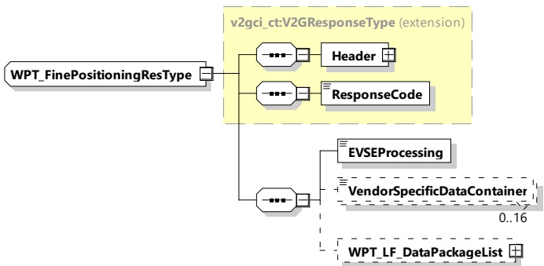

Figure 75 — Schema diagram - WPT_FinePositioningRes

The elements of this message are used according to Table 71.

Table 71 — Semantics and type definition for WPT_FinePositioningRes

<table border=1 style='margin: auto; word-wrap: break-word;'><tr><td style='text-align: center; word-wrap: break-word;'>Element Name</td><td style='text-align: center; word-wrap: break-word;'>Type</td><td style='text-align: center; word-wrap: break-word;'>Semantics</td></tr><tr><td style='text-align: center; word-wrap: break-word;'>Header</td><td style='text-align: center; word-wrap: break-word;'>complexType: MessageHeaderType refer to 8.3.3</td><td style='text-align: center; word-wrap: break-word;'>Contains general information, used for all messages.</td></tr><tr><td style='text-align: center; word-wrap: break-word;'>ResponseCode</td><td style='text-align: center; word-wrap: break-word;'>simpleType: responseCodeType enumeration refer to Annex A for the type definition</td><td style='text-align: center; word-wrap: break-word;'>ResponseCode indicating the acknowledgment status of any of the V2G messages received by the SECC.</td></tr><tr><td style='text-align: center; word-wrap: break-word;'>EVSEProcessing</td><td style='text-align: center; word-wrap: break-word;'>simpleType: processingType enumeration refer to Annex A for the type definition</td><td style='text-align: center; word-wrap: break-word;'>Parameter that indicates the stop of the Fine positioning process by the EV. When the EVSE stops the fine positioning process, the EVSEProcessing is set to &quot;Finished&quot;, while still running it is set to &quot;Ongoing&quot;.</td></tr><tr><td style='text-align: center; word-wrap: break-word;'>VendorSpecificDataContainer</td><td style='text-align: center; word-wrap: break-word;'>simpleType: WPT_DataContainerType, refer to Annex A for the type definition</td><td style='text-align: center; word-wrap: break-word;'>Optional: Data container for additional vendor specific information.</td></tr><tr><td style='text-align: center; word-wrap: break-word;'>WPT_LF_DataPackageList</td><td style='text-align: center; word-wrap: break-word;'>simpleType: WPT_LF_DataPackageListType refer to Annex A for the type definition</td><td style='text-align: center; word-wrap: break-word;'>Optional: Used when LF_TxPrimaryDevice of LF_TxEV is chosen as FinePositioning method. The element includes information about received or transmitted LF signal data.</td></tr></table>

###### 8.3.4.6.4 WPT Pairing