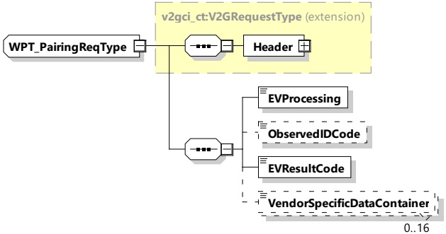

The application of pairing for WPT and the sequence of parameter exchange is described in IEC 61980-2. It describes the exchange of parameters between EVCC and SECC for the different possible methods, which are considered in combination with WPT.

After the SDP process, SessionSetup and vehicle positioning have been finished the pairing shall be applied in order to identify the EVSE and the primary device, over which the EV has been positioned.

NOTE The identifier of the EV and the EVSE which are typically determined during pairing might already be exchanged during the SDP process. This, however, does not replace the exchange of the pairing messages together with the pairing process as described in IEC 61980-2.

####### 8.3.4.6.4.1 WPT_PairingReq/Res handling

The EV will start the pairing process by applying the WPT_PairingReq (see 8.3.4.6.4.2). The SECC answers with the WPT_PairingRes (see 8.3.4.6.4.3). The parameters of the messages and their values are used according to the selected pairing method. The selection of the pairing method takes place during WPT_FinePositioningSetup. Refer to IEC 61980-2 for the sequence and application of parameter exchange.

####### 8.3.4.6.4.2 WPT_PairingReq

[V2G20-5100] The EVCC and the SECC shall implement the message elements as defined in Figure 76 and Table 72.

Figure 76 — Schema diagram - WPT_PairingReq

The message elements of this message are used as defined in Table 72.

Table 72 — Semantics and type definition for WPT_PairingReq

<table border=1 style='margin: auto; word-wrap: break-word;'><tr><td style='text-align: center; word-wrap: break-word;'>Element Name</td><td style='text-align: center; word-wrap: break-word;'>Type</td><td style='text-align: center; word-wrap: break-word;'>Semantics</td></tr><tr><td style='text-align: center; word-wrap: break-word;'>Header</td><td style='text-align: center; word-wrap: break-word;'>complexType:MessageHeaderTyperefer to 8.3.3</td><td style='text-align: center; word-wrap: break-word;'>Contains general information, used for all messages.</td></tr><tr><td style='text-align: center; word-wrap: break-word;'>EVProcessing</td><td style='text-align: center; word-wrap: break-word;'>simpleType:processingTypeenumerationrefer to Annex A for the type definition</td><td style='text-align: center; word-wrap: break-word;'>Parameter that indicates the stop of the Pairing process by the EV. When the EV stops the pairing process, the EVProcessing is set to &quot;Finished&quot;, while still running it is set to &quot;Ongoing&quot;.</td></tr></table>