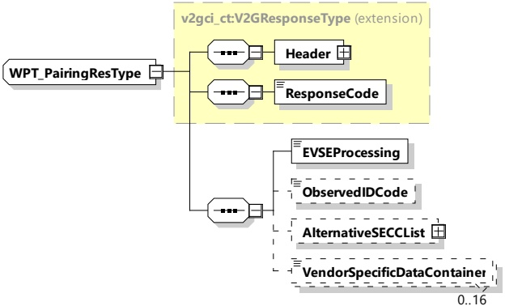

<table border=1 style='margin: auto; word-wrap: break-word;'><tr><td style='text-align: center; word-wrap: break-word;'>ObservedIDCode</td><td style='text-align: center; word-wrap: break-word;'>simpleType:numericIDTyperefer to Annex A for the type definition</td><td style='text-align: center; word-wrap: break-word;'>Optional:The identifier observed by the EV through P2PSignaling according to the pairing method applied.(omitted if not required for the pairing method).</td></tr><tr><td style='text-align: center; word-wrap: break-word;'>EVResultCode</td><td style='text-align: center; word-wrap: break-word;'>simpleType:WPT_EVResultTyperefer to Annex A for the type definition</td><td style='text-align: center; word-wrap: break-word;'>Parameter with which the EV can inform the SECC about the result of the pairing process:— EVResultUnknown,— EVResultSuccess,— EVResultFailed.</td></tr><tr><td style='text-align: center; word-wrap: break-word;'>VendorSpecificDataContainer</td><td style='text-align: center; word-wrap: break-word;'>simpleType:WPT_DataContainerTyperefer to Annex A for the type definition</td><td style='text-align: center; word-wrap: break-word;'>Optional:Data container for additional vendor specific information.</td></tr></table>

####### 8.3.4.6.4.3 WPT_PairingRes

[V2G20-5101] The EVCC and the SECC shall implement the message elements as defined in Figure 77 and Table 73.

Figure 77 — Schema diagram - WPT_PairingRes

The message elements of this message are used as defined in Table 73.

Table 73 — Semantics and type definition for WPT_PairingRes

<table border=1 style='margin: auto; word-wrap: break-word;'><tr><td style='text-align: center; word-wrap: break-word;'>Element Name</td><td style='text-align: center; word-wrap: break-word;'>Type</td><td style='text-align: center; word-wrap: break-word;'>Semantics</td></tr><tr><td style='text-align: center; word-wrap: break-word;'>Header</td><td style='text-align: center; word-wrap: break-word;'>complexType:MessageHeaderTypeRefer to 8.3.3</td><td style='text-align: center; word-wrap: break-word;'>Contains general information, used for all messages.</td></tr></table>