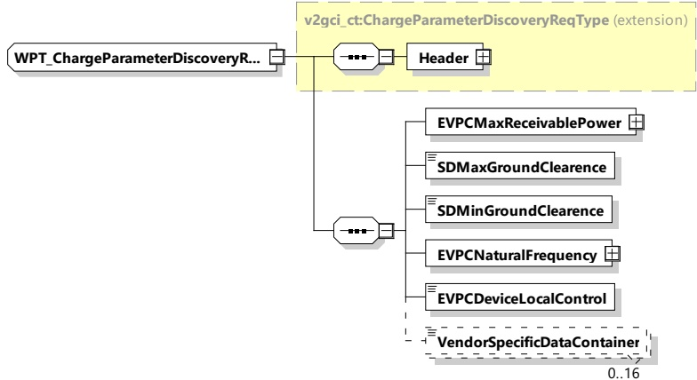

When using the dynamic control mode, the energy transfer parameters can be changed dynamically while in the Charging Loop, depending on the need of the EVSE.

####### 8.3.4.6.5.2 WPT_ChargeParameterDiscoveryReq

By sending the WPT_ChargeParameterDiscoveryReq message the EVCC provides its energy transfer parameters to the SECC. This message provides status information about the EV, i.e. the capabilities of the EV charging system.

[V2G20-5019] The EVCC shall send the WPT_ChargeParameterDiscoveryReq message with the elements of the message set according to the technical characteristics of the EV device.

[V2G20-5128] The EVCC and the SECC shall implement the message elements as defined in Figure 78 and Table 74.

Figure 78 — Schema diagram - WPT_ChargeParameterDiscoveryReq

The elements of this message are used according to Table 74.

Table 74 — Semantics and type definition for WPT_ChargeParameterDiscoveryReq

<table border=1 style='margin: auto; word-wrap: break-word;'><tr><td style='text-align: center; word-wrap: break-word;'>Element Name</td><td style='text-align: center; word-wrap: break-word;'>Type</td><td style='text-align: center; word-wrap: break-word;'>Semantics</td></tr><tr><td style='text-align: center; word-wrap: break-word;'>Header</td><td style='text-align: center; word-wrap: break-word;'>complexType:MessageHeaderTyperefer to 8.3.3</td><td style='text-align: center; word-wrap: break-word;'>Contains general information, used for all messages.</td></tr><tr><td style='text-align: center; word-wrap: break-word;'>EVPCMaxReceivablePower</td><td style='text-align: center; word-wrap: break-word;'>complexTypeRationalNumberTyperefer to 8.3.5.3.8</td><td style='text-align: center; word-wrap: break-word;'>Maximum power in watts which EVPC can receive</td></tr><tr><td style='text-align: center; word-wrap: break-word;'>SDMaxGroundClearence</td><td style='text-align: center; word-wrap: break-word;'>simpleType:xs:unsignedShort</td><td style='text-align: center; word-wrap: break-word;'>Maximum value of secondary device ground clearance in mm</td></tr><tr><td style='text-align: center; word-wrap: break-word;'>SDMinGroundClearence</td><td style='text-align: center; word-wrap: break-word;'>simpleType:xs:unsignedShort</td><td style='text-align: center; word-wrap: break-word;'>Minimum value of secondary device ground clearance in mm</td></tr></table>