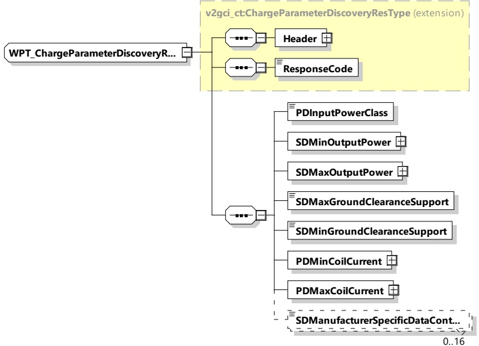

Figure 79 — Schema diagram - WPT_ChargeParameterDiscoveryRes

The elements of this message are used according to Table 75.

Table 75 — Semantics and type definition for WPT_ChargeParameterDiscoveryRes

<table border=1 style='margin: auto; word-wrap: break-word;'><tr><td style='text-align: center; word-wrap: break-word;'>Element Name</td><td style='text-align: center; word-wrap: break-word;'>Type</td><td style='text-align: center; word-wrap: break-word;'>Semantics</td></tr><tr><td style='text-align: center; word-wrap: break-word;'>Header</td><td style='text-align: center; word-wrap: break-word;'>complexType:MessageHeaderTyperefer to 8.3.3</td><td style='text-align: center; word-wrap: break-word;'>Contains general information, used for all messages.</td></tr><tr><td style='text-align: center; word-wrap: break-word;'>ResponseCode</td><td style='text-align: center; word-wrap: break-word;'>simpleType:responseCodeTyperefer to Annex A for the type definition</td><td style='text-align: center; word-wrap: break-word;'>ResponseCode indicating the acknowledgment status of any of the V2G messages received by the SECC.</td></tr><tr><td style='text-align: center; word-wrap: break-word;'>PDInputPowerClass</td><td style='text-align: center; word-wrap: break-word;'>simpleType:WPT_PowerClassTyperefer to Annex A for the type definition</td><td style='text-align: center; word-wrap: break-word;'>Power class supported by the primary device. Possible values for MF-WPT input power classes are:MF-WPT1,MF-WPT2,MF-WPT3 and MF-WPT4 according to IEC TS 61980-3</td></tr><tr><td style='text-align: center; word-wrap: break-word;'>SDMinOutputPower</td><td style='text-align: center; word-wrap: break-word;'>complexType:RationalNumberTyperefer to 8.3.5.3.8</td><td style='text-align: center; word-wrap: break-word;'>Minimum power in watts drawn by the secondary device</td></tr><tr><td style='text-align: center; word-wrap: break-word;'>SDMaxOutputPower</td><td style='text-align: center; word-wrap: break-word;'>complexType:RationalNumberTyperefer to 8.3.5.3.8</td><td style='text-align: center; word-wrap: break-word;'>Maximum power in watts drawn by the secondary device</td></tr></table>