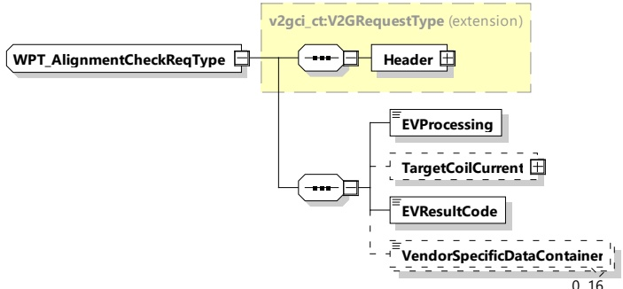

<table border=1 style='margin: auto; word-wrap: break-word;'><tr><td style='text-align: center; word-wrap: break-word;'>Element Name</td><td style='text-align: center; word-wrap: break-word;'>Type</td><td style='text-align: center; word-wrap: break-word;'>Semantics</td></tr><tr><td style='text-align: center; word-wrap: break-word;'>SDMaxGroundClearanceSupport</td><td style='text-align: center; word-wrap: break-word;'>simpleType:xs:unsignedShort</td><td style='text-align: center; word-wrap: break-word;'>Maximum value of supported secondary device ground clearance in mm</td></tr><tr><td style='text-align: center; word-wrap: break-word;'>SDMinGroundClearanceSupport</td><td style='text-align: center; word-wrap: break-word;'>simpleType:xs:unsignedShort</td><td style='text-align: center; word-wrap: break-word;'>Minimum value of the secondary device ground clearance in mm</td></tr><tr><td style='text-align: center; word-wrap: break-word;'>PDMinCoilCurrent</td><td style='text-align: center; word-wrap: break-word;'>complexType:RationalNumberTyperefer to 8.3.5.3.8</td><td style='text-align: center; word-wrap: break-word;'>Minimum current through the primary coil, which can be controlled by the primary device</td></tr><tr><td style='text-align: center; word-wrap: break-word;'>PDMaxCoilCurrent</td><td style='text-align: center; word-wrap: break-word;'>complexType:RationalNumberTyperefer to 8.3.5.3.8</td><td style='text-align: center; word-wrap: break-word;'>Maximum current through the primary coil, which can be controlled by the primary device</td></tr><tr><td style='text-align: center; word-wrap: break-word;'>SDManufacturerSpecificDataContainer</td><td style='text-align: center; word-wrap: break-word;'>simpleType:WPT_DataContainerTyperefer to Annex A for the type definition</td><td style='text-align: center; word-wrap: break-word;'>Optional:Manufacturer specific data container, containing, e.g. manufacturer ID and Model ID</td></tr></table>

###### 8.3.4.6.6 WPT\_AlignmentCheckReq/Res

The WPT\_AlignmentCheckReq/Res messages are used to exchange information needed to perform the alignment check, with which the proper position of the EV device with the primary device is checked and confirmed (See IEC 61980-2).

8.3.4.6.6.1 WPT\_AlignmentCheckReq/Res handling

8.3.4.6.6.2 WPT\_AlignmentCheckReq

[V2G20-5015] The EVCC and the SECC shall implement the message elements as defined in Figure 80 and Table 76.

Figure 80 — Schema diagram - WPT\_AlignmentCheckReq

The elements of this message are used according to Table 76.