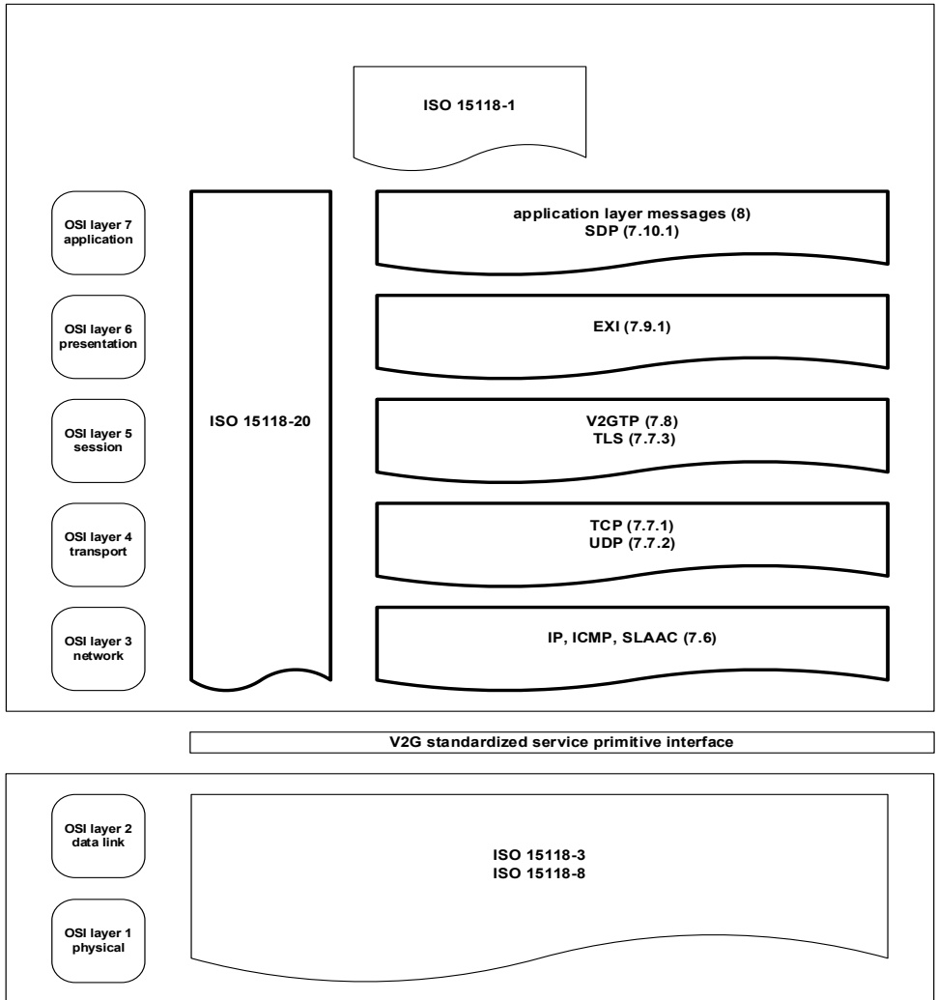

Figure 2 — Vehicle to grid communication document overview

## 7 Basic requirements for V2G communication

### 7.1 General information

This document describes the realization of the V2G use case elements defined in ISO 15118-1.