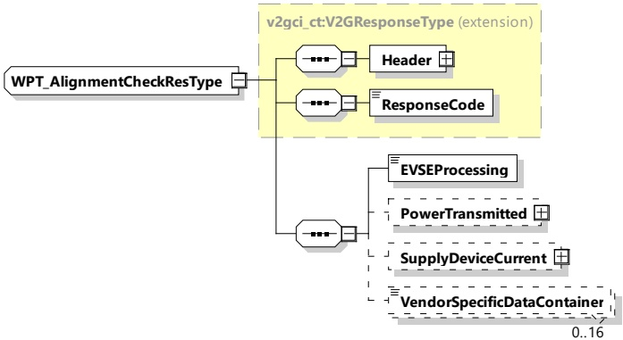

Figure 81 — Schema diagram - WPT\_AlignmentCheckRes

The elements of this message are used according to Table 77.

Table 77 — Semantics and type definition for WPT\_AlignmentCheckRes

<table border=1 style='margin: auto; word-wrap: break-word;'><tr><td style='text-align: center; word-wrap: break-word;'>Element Name</td><td style='text-align: center; word-wrap: break-word;'>Type</td><td style='text-align: center; word-wrap: break-word;'>Semantics</td></tr><tr><td style='text-align: center; word-wrap: break-word;'>Header</td><td style='text-align: center; word-wrap: break-word;'>complexType:MessageHeaderTyperefer to 8.3.3</td><td style='text-align: center; word-wrap: break-word;'>Contains general information, used for all messages.</td></tr><tr><td style='text-align: center; word-wrap: break-word;'>ResponseCode</td><td style='text-align: center; word-wrap: break-word;'>simpleType:responseCodeTyperefer to Annex A for the type definition</td><td style='text-align: center; word-wrap: break-word;'>ResponseCode indicating the acknowledgment status of any of the V2G messages received by the SECC.</td></tr><tr><td style='text-align: center; word-wrap: break-word;'>EVSEProcessing</td><td style='text-align: center; word-wrap: break-word;'>simpleType:processingTyperefer to Annex A for the type definition</td><td style='text-align: center; word-wrap: break-word;'>Parameter indicating that the EVSE has finished the processing that was initiated after the WPT_AlignmentCheckReq or if the EVSE is still processing at the time, the response message was sent.</td></tr><tr><td style='text-align: center; word-wrap: break-word;'>PowerTransmitted</td><td style='text-align: center; word-wrap: break-word;'>complexTypeRationalNumberTyperefer to 8.3.5.3.8</td><td style='text-align: center; word-wrap: break-word;'>Optional:The amount of power in watts transmitted by the supply device</td></tr><tr><td style='text-align: center; word-wrap: break-word;'>SupplyDeviceCurrent</td><td style='text-align: center; word-wrap: break-word;'>complexTypeRationalNumberTyperefer to 8.3.5.3.8</td><td style='text-align: center; word-wrap: break-word;'>Optional:The amount of current in amperes into the supply device coil</td></tr><tr><td style='text-align: center; word-wrap: break-word;'>VendorSpecificDataContainer</td><td style='text-align: center; word-wrap: break-word;'>simpleType:WPT_DataContainerTyperefer to Annex A for the type definition</td><td style='text-align: center; word-wrap: break-word;'>Optional:Data container for additional vendor specific information.This element is used primarily when a proprietary alignment check method was selected with the FinePositioningSetup</td></tr></table>

###### 8.3.4.6.7 WPT_ChargeLoopReq/Res