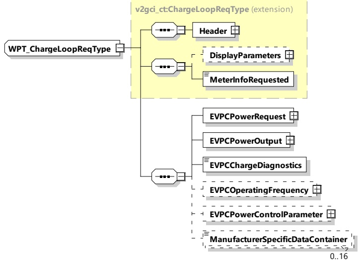

For WPT periodic exchange of process control data is requested from EV side, see IEC 61980-2.

####### 8.3.4.6.7.1 WPT_ChargeLoopReq/Res handling

The WPT_ChargeLoopReq/Res messages are used for the periodic exchange of process control data. The messages are derived from the ChargeLoopReq/Res messages defined in the common module (see ChargeLoopReqType) and extended by the parameters necessary for the handling of wireless power transfer according to IEC 61980-2.

####### 8.3.4.6.7.2 WPT_ChargeLoopReq

By sending the WPT_ChargeLoopReq the EV requests a certain power from the EVSE.

[V2G20-1296]

The EVCC and the SECC shall implement the message elements as defined in Table 78 and Figure 82.

Figure 82 — Schema diagram - WPT_ChargeLoopReq

The elements of this message are used according to Table 78.

Table 78 — Semantics and type definition for WPT_ChargeLoopReq

<table border=1 style='margin: auto; word-wrap: break-word;'><tr><td style='text-align: center; word-wrap: break-word;'>Element Name</td><td style='text-align: center; word-wrap: break-word;'>Type</td><td style='text-align: center; word-wrap: break-word;'>Semantics</td></tr><tr><td style='text-align: center; word-wrap: break-word;'>Header</td><td style='text-align: center; word-wrap: break-word;'>complexType:MessageHeaderTyperefer to 8.3.3</td><td style='text-align: center; word-wrap: break-word;'>Contains general information, used for all messages.</td></tr><tr><td style='text-align: center; word-wrap: break-word;'>EVPCPowerRequest</td><td style='text-align: center; word-wrap: break-word;'>complexTypeRationalNumberTyperefer to 8.3.5.3.8</td><td style='text-align: center; word-wrap: break-word;'>Power the EVPC would like to have as output in Watt. Note that setting this value to zero is valid.</td></tr></table>