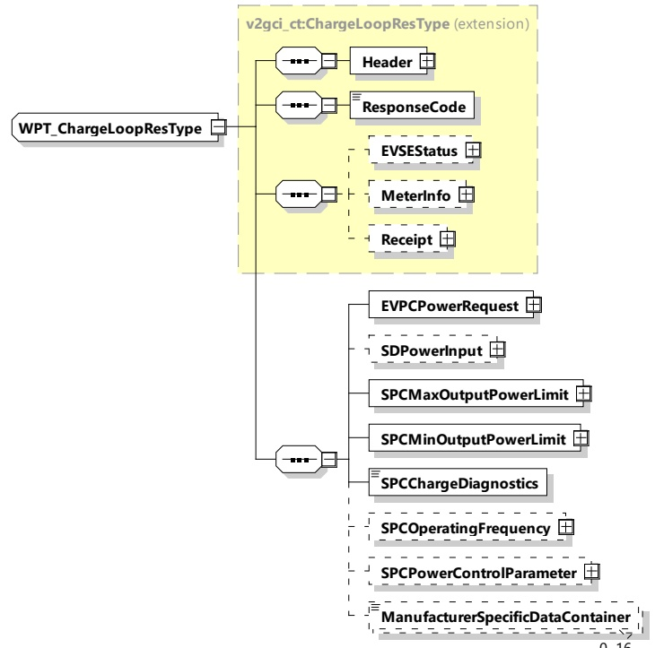

[V2G20-5028]

The EVCC and the SECC shall implement the message elements as defined in Table 79 and Figure 83.

Figure 83 — Schema diagram - WPT_ChargeLoopRes

The elements of this message are used according to Table 79.

Table 79 — Semantics and type definition for WPT_ChargeLoopRes

<table border=1 style='margin: auto; word-wrap: break-word;'><tr><td style='text-align: center; word-wrap: break-word;'>Element Name</td><td style='text-align: center; word-wrap: break-word;'>Type</td><td style='text-align: center; word-wrap: break-word;'>Semantics</td></tr><tr><td style='text-align: center; word-wrap: break-word;'>Header</td><td style='text-align: center; word-wrap: break-word;'>complexType:MessageHeaderTyperefer to 8.3.3</td><td style='text-align: center; word-wrap: break-word;'>Contains general information, used for all messages.</td></tr><tr><td style='text-align: center; word-wrap: break-word;'>EVPCPowerRequest</td><td style='text-align: center; word-wrap: break-word;'>complexTypeRationalNumberTyperefer to 8.3.5.3.8</td><td style='text-align: center; word-wrap: break-word;'>Power value which was requested by the EVCC</td></tr><tr><td style='text-align: center; word-wrap: break-word;'>SDPowerInput</td><td style='text-align: center; word-wrap: break-word;'>complexTypeRationalNumberTyperefer to 8.3.5.3.8</td><td style='text-align: center; word-wrap: break-word;'>Optional:DC power consumed from the MF-WPT system input by the supply device in Watt. The EVCC compares the value with the received EVPCPowerOutput in order to detect possible misbehavior. This value is for information only without any impact on safety relative actions.</td></tr></table>