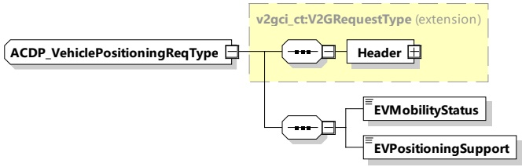

it can decide whether it is sufficiently in position to initiate charging or send another ACDP_VehiclePositioningReq. This looping continues until the EVCC decides that it is in position and is also immobilized. Then, it will then send a ACDP_VehiclePositioningReq with EVMobilityStatus=Immobilized. The SECC will reply with a ACDP_VehiclePositioningRes with EVSEProcessing=Finished and the sequence will continue with AuthorizationSetupReq.

the EVCC does not support SECC supported positioning. The EVCC will send ACDP_VehiclePositioningReq with EVPositioningSupport=False, and EVMobilityStatus=Mobilized. The SECC will reply with ACDP_VehiclePositioningRes with EVSEPositioningSupport=False/True (do not care) and EVSEProcessing=Ongoing. When the EVCC receives this information, the EV can decide whether it is sufficiently in position (using other means, such as the driver using visual aids to park, or advanced EV sensors) to stop the positioning process, or to send another ACDP_VehiclePositioningReq in a loop. This looping continues until the EV decides that the EV is in position, and is also immobilized. Then it will then send a ACDP_VehiclePositioningReq with EVMobilityStatus=Immobilized. The SECC will reply with a ACDP_VehiclePositioningRes with EVSEProcessing=Finished, and the sequence will continue with AuthorizationSetupReq.

Case 3: the EVCC supports positioning, but the SECC does not. In this case, the EVCC will send ACDP_VehiclePositioningReq with EVPositioningSupport=True, and EVMobilityStatus=Mobilized. The SECC will reply ACDP_VehiclePositioningRes with EVSEPositioningSupport=False and EVSEProcessing=Ongoing. At this point, the EVCC may allow for manual positioning of the EV as described in the second case. If the EVCC decides that it requires SECC positioning support, it may stop the charging process by sending SessionStop.

In all cases where there is an ongoing positioning loop, the SECC monitors its PPD to verify that pairing is still correct. If the EV moves out of the pairing zone, then the SECC will send ACDP_VehiclePositioningRes with ResponseCode=FAILED_AssociationError, the EVCC will send SessionStop and the SDP process will restart.

NOTE 1 If the EV already knows it is in position and is also immobilized, then no loop is required, and the EVCC can directly send a ACDP_VehiclePositioningReq with EVMobilityStatus=Immobilized. The SECC will then reply with a ACDP_VehiclePositioningRes with EVSEProcessing=Finished, and the sequence will continue with AuthorizationSetupReq.

NOTE 2 Positioning support with the RFID PPD is very basic. The only information that is returned by the SECC is EV_InChargePosition = True/False. This information indicates that the EV is within/not within the partition zone for charging.

NOTE 3 It is possible that more than one PPD technology is available. For example, the EV and EVSE have both the Basic RFID PPD as well as an advanced optical PPD. Since the active part of the PPD is always on the EVSE, the EVSE can determine the presence of the advanced optical PPD during the SDP pairing for WLAN process and continue using this during the positioning process.

####### 8.3.4.7.5.2 ACDP_VehiclePositioningReq

[V2G20-4004] The EVCC and the SECC shall implement the message elements as defined in Figure 84 and Table 81.

