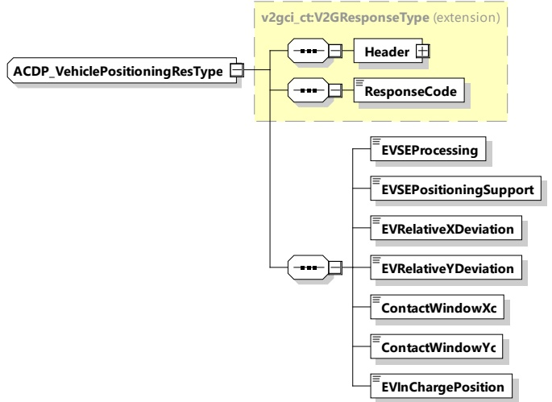

## Figure 84— Schema diagram ACDP_VehiclePositioningReq

The elements of this message are used according to Table 81.

Table 81 — Semantics and type definition for ACDP_VehiclePositioningReq

<table border=1 style='margin: auto; word-wrap: break-word;'><tr><td style='text-align: center; word-wrap: break-word;'>Element Name</td><td style='text-align: center; word-wrap: break-word;'>Type</td><td style='text-align: center; word-wrap: break-word;'>Semantics</td></tr><tr><td style='text-align: center; word-wrap: break-word;'>Header</td><td style='text-align: center; word-wrap: break-word;'>complexType:MessageHeaderTypeRefer to 8.3.3</td><td style='text-align: center; word-wrap: break-word;'>Contains general information, used for all messages.</td></tr><tr><td style='text-align: center; word-wrap: break-word;'>EVMobilityStatus</td><td style='text-align: center; word-wrap: break-word;'>simpleType:xs:boolean</td><td style='text-align: center; word-wrap: break-word;'>— EV is mobilized = 0— EV is immobilized = 1</td></tr><tr><td style='text-align: center; word-wrap: break-word;'>EVPositioningSupport</td><td style='text-align: center; word-wrap: break-word;'>simpleType:xs:boolean</td><td style='text-align: center; word-wrap: break-word;'>Indicates whether positioning is supported by the EV.— No EV Position Support = 0— EV Position Support = 1</td></tr></table>

####### 8.3.4.7.5.3 ACDP_VehiclePositioningRes

[V2G20-4005] The EVCC and the SECC shall implement the message elements as defined in Figure 85 and Table 82.

Figure 85—Schema diagram ACDP_VehiclePositioningRes

The elements of this message are used according to Table 82.