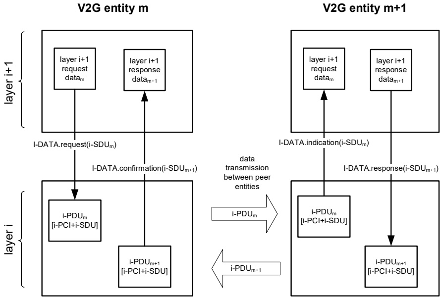

### 7.2 Service primitive concept of OSI layered architecture

#### 7.2.1 Overview

This subclause explains how the OSI layered architecture is applied for the purpose of this document. It is intended to provide simple means for describing the interfaces between the individual communication protocol layers required by this document and furthermore allows for defining timing requirements more precisely.

Services are specified by describing the service primitives and parameters that characterize a service. This is an abstract definition of services and does not force a particular implementation.

Figure 3 depicts a simplified view of OSI layer interaction sufficient to understand the OSI layered architecture principles for the context of this document.

Figure 3 — OSI layered architecture principles

When a layer i+1 instance of V2G entity m exchanges data with a layer i+1 instance of V2G entity m+1 each instance uses services of an instance of layer i. A service is defined as a set of service primitives.

#### 7.2.2 Syntax of service primitives

Service primitives are described with the following syntax:

- [Initial of layer]-[NAME].[primitive type](parameter list);

## 18 

Copied with the permission of ANSI on behalf of ISO in connection with USDOT National Electric Vehicle Infrastructure (NEVI) Formula Program. Copying not permitted. ©ISO. All rights reserved.