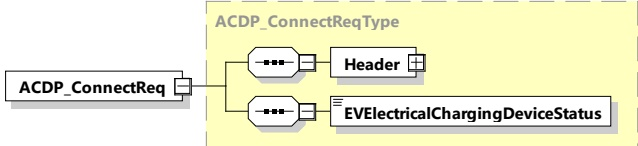

<table border=1 style='margin: auto; word-wrap: break-word;'><tr><td style='text-align: center; word-wrap: break-word;'>Element Name</td><td style='text-align: center; word-wrap: break-word;'>Type</td><td style='text-align: center; word-wrap: break-word;'>Semantics</td></tr><tr><td style='text-align: center; word-wrap: break-word;'>EVInChargePosition</td><td style='text-align: center; word-wrap: break-word;'>simpleType:xs:boolean</td><td style='text-align: center; word-wrap: break-word;'>Option in case of positioning supported:Indicates whether the EV is positioned within allowed tolerances to ACDP.States:• EVNotInChargePosition = 0• EVInChargePosition = 1</td></tr></table>

###### 8.3.4.7.6 ACDP_ConnectReq/Res

####### 8.3.4.7.6.1 ACDP_ConnectReq/Res handling

This message pattern is used to initiate the connecting process of the ACDP.

####### 8.3.4.7.6.2 ACDP_ConnectReq

[V2G20-4006]

The EVCC and the SECC shall implement the message elements as defined in Figure 86 and Table 83.

Figure 86 — Schema diagram - ACDP_ConnectReq

The elements of this message are used according to Table 83.

Table 83 — Semantics and type definition for ACDP_ConnectReq

<table border=1 style='margin: auto; word-wrap: break-word;'><tr><td style='text-align: center; word-wrap: break-word;'>Element Name</td><td style='text-align: center; word-wrap: break-word;'>Type</td><td style='text-align: center; word-wrap: break-word;'>Semantics</td></tr><tr><td style='text-align: center; word-wrap: break-word;'>Header</td><td style='text-align: center; word-wrap: break-word;'>complexType:MessageHeaderTyperefer to 8.3.3</td><td style='text-align: center; word-wrap: break-word;'>Contains general information, used for all messages.</td></tr><tr><td style='text-align: center; word-wrap: break-word;'>EVElectricalChargingDeviceStatus</td><td style='text-align: center; word-wrap: break-word;'>simpleType:electricalChargingDeviceStatusTyperefer to Annex A for the type definition</td><td style='text-align: center; word-wrap: break-word;'>This element provides the information if the conductive connection between the EV and EVSE is in state &quot;connected&quot; (CP State = B, C or D) or &quot;disconnected&quot; (CP State = A).</td></tr></table>

####### 8.3.4.7.6.3 ACDP_ConnectRes

## [V2G20-4007]

The EVCC and the SECC shall implement the message elements as defined in Figure 87 and Table 84.