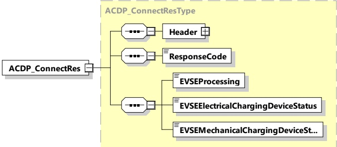

Figure 87 — Schema diagram - ACDP_ConnectRes

The elements of this message are used according to Table 84.

Table 84 — Semantics and type definition for ACDP_ConnectRes

<table border=1 style='margin: auto; word-wrap: break-word;'><tr><td style='text-align: center; word-wrap: break-word;'>Element Name</td><td style='text-align: center; word-wrap: break-word;'>Type</td><td style='text-align: center; word-wrap: break-word;'>Semantics</td></tr><tr><td style='text-align: center; word-wrap: break-word;'>Header</td><td style='text-align: center; word-wrap: break-word;'>complexType:MessageHeaderTyperefer to 8.3.3</td><td style='text-align: center; word-wrap: break-word;'>Contains general information, used for all messages.</td></tr><tr><td style='text-align: center; word-wrap: break-word;'>ResponseCode</td><td style='text-align: center; word-wrap: break-word;'>simpleType:responseCodeTyperefer to Annex A for the type definition</td><td style='text-align: center; word-wrap: break-word;'>ResponseCodeindicating the acknowledgment status of any of the V2G messages received by the SECC.</td></tr><tr><td style='text-align: center; word-wrap: break-word;'>EVSEProcessing</td><td style='text-align: center; word-wrap: break-word;'>simpleType:processingTyperefer to Annex A for the type definition</td><td style='text-align: center; word-wrap: break-word;'>Parameterindicating that the EVSE has finished the processing that was initiated after the ACDP_ConnectReq or if the EVSE is still processing at the time, the response message was sent.</td></tr><tr><td style='text-align: center; word-wrap: break-word;'>EVSEElectricalChargingDeviceStatus</td><td style='text-align: center; word-wrap: break-word;'>simpleType:electricalChargingDeviceStatusTyperefer to Annex A for the type definition</td><td style='text-align: center; word-wrap: break-word;'>This element provides the information if the conductive connection between the EV and EVSE is in state &quot;connected&quot; (CP State = B, C or D) or &quot;disconnected&quot; (CP State = A).</td></tr></table>