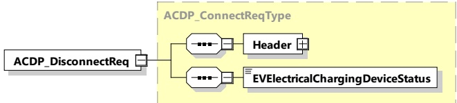

<table border=1 style='margin: auto; word-wrap: break-word;'><tr><td style='text-align: center; word-wrap: break-word;'>Element Name</td><td style='text-align: center; word-wrap: break-word;'>Type</td><td style='text-align: center; word-wrap: break-word;'>Semantics</td></tr><tr><td style='text-align: center; word-wrap: break-word;'>EVSEMechanicalChargingDeviceStatus</td><td style='text-align: center; word-wrap: break-word;'>simpleType: mechanicalChargingDeviceStatusType refer to Annex A for the type definition</td><td style='text-align: center; word-wrap: break-word;'>This element provides the information if the ACDP status of the EVSE is in home, or end position or if it is in a moving state.</td></tr></table>

###### 8.3.4.7.7 ACDP_DisconnectReq/Res

####### 8.3.4.7.7.1 ACDP_DisconnectReq

[V2G20-4008] The EVCC and the SECC shall implement the message elements as defined in Figure 88 and

Table 85.

Figure 88 — Schema diagram - ACDP_DisconnectReq

The elements of this message are used according to Table 85.

Table 85 — Semantics and type definition for ACDP_DisconnectReq

<table border=1 style='margin: auto; word-wrap: break-word;'><tr><td style='text-align: center; word-wrap: break-word;'>Element Name</td><td style='text-align: center; word-wrap: break-word;'>Type</td><td style='text-align: center; word-wrap: break-word;'>Semantics</td></tr><tr><td style='text-align: center; word-wrap: break-word;'>Header</td><td style='text-align: center; word-wrap: break-word;'>complexType:MessageHeaderTyperefer to 8.3.3</td><td style='text-align: center; word-wrap: break-word;'>Contains general information, used for all messages.</td></tr><tr><td style='text-align: center; word-wrap: break-word;'>EVElectricalChargingDeviceStatus</td><td style='text-align: center; word-wrap: break-word;'>simpleType:electricalChargingDeviceStatusTyperefer to Annex A for the type definition</td><td style='text-align: center; word-wrap: break-word;'>This element provides the information if the conductive connection between the EV and EVSE is in state &quot;connected&quot; (CP State = B, C or D) or &quot;disconnected&quot; (CP State = A).</td></tr></table>

####### 8.3.4.7.7.2 ACDP_DisconnectRes

The EVCC and the SECC shall implement the message elements as defined in Figure 89 and Table 86.