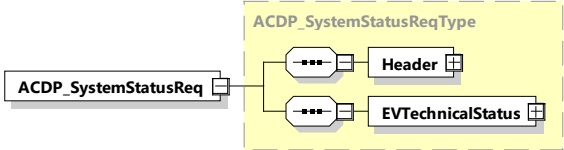

Figure 90 — Schema diagram - ACDP_SystemStatusReq

The elements of this message are used according to Table 87.

Table 87 — Semantics and type definition for ACDP_SystemStatusReq

<table border=1 style='margin: auto; word-wrap: break-word;'><tr><td style='text-align: center; word-wrap: break-word;'>Element Name</td><td style='text-align: center; word-wrap: break-word;'>Type</td><td style='text-align: center; word-wrap: break-word;'>Semantics</td></tr><tr><td style='text-align: center; word-wrap: break-word;'>Header</td><td style='text-align: center; word-wrap: break-word;'>complexType:MessageHeaderTyperefer to 8.3.3</td><td style='text-align: center; word-wrap: break-word;'>Contains general information, used for all messages.</td></tr><tr><td style='text-align: center; word-wrap: break-word;'>EVTechnicalStatus</td><td style='text-align: center; word-wrap: break-word;'>complexType:EVTechnicalStatusTyperefer to 8.3.5.7.1</td><td style='text-align: center; word-wrap: break-word;'>This element provides detailed EV technical status</td></tr></table>

####### 8.3.4.7.8.3 ACDP\_SystemStatusRes

[V2G20-4012] The EVCC and the SECC shall implement the message elements as defined in Figure 91 and Table 88.

For ACDP charging method the EV positions itself correctly relative to the position of the ACDP. Before the ACDP can be activated the EV becomes immobilized. At the end of the charging process the EV is kept immobilized as long as the ACDP is not at its home position. The driver can control the immobilization request by the EV hand brake or any other technical means. On the other hand, the driver can end the charging process at any time by releasing the hand brake. In this case the mobilization of the EV waits until the ACDP is in home position.