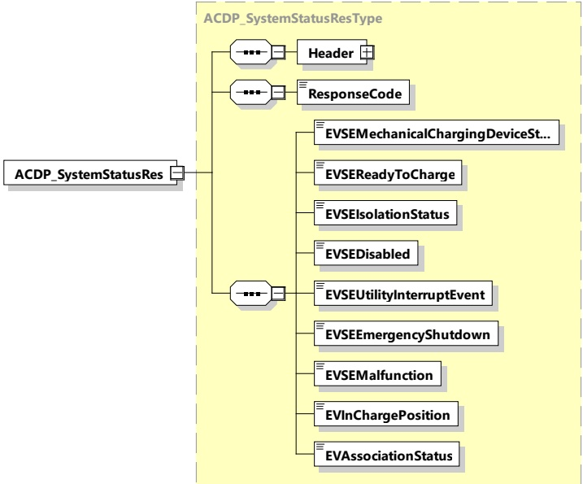

Figure 91 — Schema diagram - ACDP_SystemStatusRes

The elements of this message are used according to Table 88.

Table 88 — Semantics and type definition for ACDP_SystemStatusRes

<table border=1 style='margin: auto; word-wrap: break-word;'><tr><td style='text-align: center; word-wrap: break-word;'>Element Name</td><td style='text-align: center; word-wrap: break-word;'>Type</td><td style='text-align: center; word-wrap: break-word;'>Semantics</td></tr><tr><td style='text-align: center; word-wrap: break-word;'>Header</td><td style='text-align: center; word-wrap: break-word;'>complexType:MessageHeaderTyperefer to 8.3.3</td><td style='text-align: center; word-wrap: break-word;'>Contains general information, used for all messages.</td></tr><tr><td style='text-align: center; word-wrap: break-word;'>ResponseCode</td><td style='text-align: center; word-wrap: break-word;'>simpleType:responseCodeTyperefer to Annex A for the type definition</td><td style='text-align: center; word-wrap: break-word;'>ResponseCode indicating the acknowledgment status of any of the V2G messages received by the SECC.</td></tr><tr><td style='text-align: center; word-wrap: break-word;'>EVSEMechanicalChargingDeviceStatus</td><td style='text-align: center; word-wrap: break-word;'>simpleType:mechanicalChargingDeviceStatusTyperefer to Annex A for the type definition</td><td style='text-align: center; word-wrap: break-word;'>This element provides the information if the ACDP status of the EVSE is in home, or end position or if it is in a moving state.</td></tr><tr><td style='text-align: center; word-wrap: break-word;'>EVSEReadyToCharge</td><td style='text-align: center; word-wrap: break-word;'>simpleType:xs:boolean</td><td style='text-align: center; word-wrap: break-word;'>Element signalizes when the EVSE is READY or NOT READY to charge. This comprises all required EVSE sub-systems.</td></tr><tr><td style='text-align: center; word-wrap: break-word;'>EVSEIsolationStatus</td><td style='text-align: center; word-wrap: break-word;'>simpleType:isolationStatusTyperefer to Annex A for the type definition</td><td style='text-align: center; word-wrap: break-word;'>This element provides the information about the isolation status of the EVSE. Possible states are: invalid, safe, warning, fault.</td></tr></table>