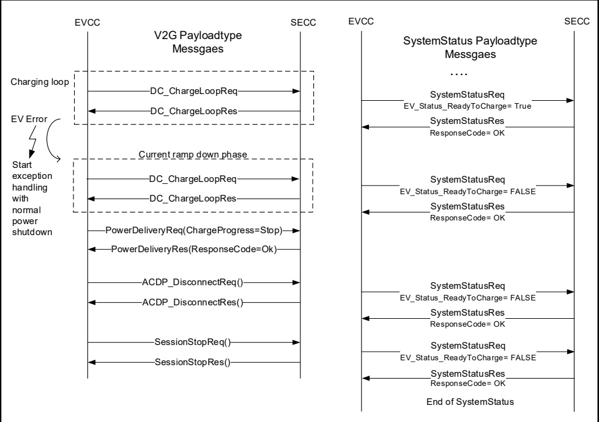

by releasing the hand brake. In that way the ACDP_SystemStatus will provide concrete information about the root cause of a normal shut down process.

Figure 92 — ACDP exception handling example on EVCC error

In this sample EV initiated error case is due to RESS overtemperature therefore the

EVTechnicalStatus of the ACDP\_SystemStatusReq will show the following contents:

EVTechnicalStatus of the ACDP\_SystemStatusReq will show the following co.

- EVReadyToCharge
  = False;
  - EVImmobilizationRequest
  = True;
  - EVWLANStrength
  = -66 dBm;
  - EVCPStatus
  = C;
  - EVSOC
  = 74 %;
  - EVErrorCode
  = 4 (RESS overtemperature);
  - EVTimeout
  = False.

- ResponseCode = OK;
- EVSEMechanicalChargingDeviceStatus = EndPosition;
- EVSEReadyToCharge = True;
- EVSEIsolationStatus = Valid;
- EVSEDisabled = False;
- EVSEUtilityInterruptEvent = False;

Copied with the permission of ANSI on behalf of ISO in connection with USDOT National Electric Vehicle Infrastructure (NEVI) Formula Program. Copying not permitted. ©ISO. All rights reserved.