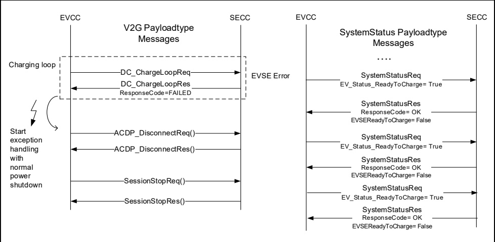

Figure 93 depicts an example EVSE error case during the processing of the DC_ChargeLoop message pair. The SECC will respond with DC_ChargeLoopRes with ResponseCode = FAILED to initiate the EV exception handling by sending a ACDP_DisconnectReq. In parallel the EV will send ACDP_SystemStatusReq in order to receive diagnostic information of the EVSE error cause.

Figure 93 — ACDP Error handling on EVSE error

##### 8.3.4.8 VAS messages

###### 8.3.4.8.1 Parking Status service

####### 8.3.4.8.1.1 VehicleCheckInReq/Res

######## 8.3.4.8.1.1.1 VehicleCheckInReq/Res handling

This message is used by a parking status service for approaching EV to get information about an EVSE. A particular application of this service is an automated valid parking system (AVPS). The main purpose of EV check in message is that EV gets information of the EV target position for optical auto parking. The reference point marked by parking guideline is recognized by optical sensor. Target offset, 3 dimensional distances between pad target point and reference point is provided by this message response. The EV will be able to know the target position by adding the target offset to the reference point. When EVs complete parking to the target space, the EVCC informs the SECC and will exit parking status.

NOTE These messages are part of the parking status service.

Further description about parking status service is provided in 8.4.3.2.7.

######## 8.3.4.8.1.1.2 VehicleCheckInReq

[V2G20-1298] The EVCC and the SECC shall implement the message elements as defined in Table 90 and Figure 94.