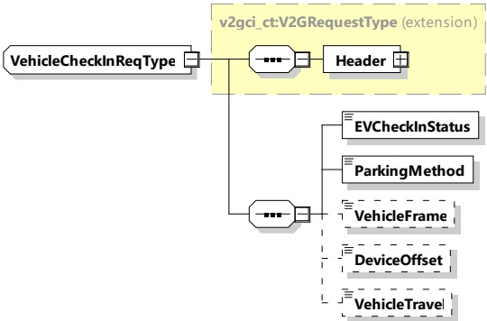

Figure 94 — Schema diagram - VehicleCheckInReq

The elements of this message are used according to Table 90.

Table 90 — Semantics and type definition for VehicleCheckInReq

<table border=1 style='margin: auto; word-wrap: break-word;'><tr><td style='text-align: center; word-wrap: break-word;'>Element Name</td><td style='text-align: center; word-wrap: break-word;'>Type</td><td style='text-align: center; word-wrap: break-word;'>Semantics</td></tr><tr><td style='text-align: center; word-wrap: break-word;'>Header</td><td style='text-align: center; word-wrap: break-word;'>complexType: MessageHeaderType refer to 8.3.3</td><td style='text-align: center; word-wrap: break-word;'>Contains general information, used for all messages.</td></tr><tr><td style='text-align: center; word-wrap: break-word;'>EVCheckInStatus</td><td style='text-align: center; word-wrap: break-word;'>simpleType: EVCheckInStatusType enumeration refer to Annex A for the type definition</td><td style='text-align: center; word-wrap: break-word;'>Set &quot;check in&quot;, &quot;processing&quot; or &quot;completed&quot; This element is used to inform to the SECC the check in status.</td></tr><tr><td style='text-align: center; word-wrap: break-word;'>ParkingMethod</td><td style='text-align: center; word-wrap: break-word;'>simpleType: parkingMethodType enumeration refer to Annex A for the type definition</td><td style='text-align: center; word-wrap: break-word;'>Set &quot;auto parking&quot; or &quot;manual&quot; This element is used to inform to the SECC the parking method.</td></tr><tr><td style='text-align: center; word-wrap: break-word;'>VehicleFrame</td><td style='text-align: center; word-wrap: break-word;'>simpleType: xs:short</td><td style='text-align: center; word-wrap: break-word;'>Optional: This element provides the information about 2 dimensional EV enveloping square, given by (VehicleWidth, VehicleLength).</td></tr><tr><td style='text-align: center; word-wrap: break-word;'>DeviceOffset</td><td style='text-align: center; word-wrap: break-word;'>simpleType: xs:short</td><td style='text-align: center; word-wrap: break-word;'>Optional: This element provides information of EV WPT device offset from EV frame, given by (OffsetWidth, OffsetLength).</td></tr><tr><td style='text-align: center; word-wrap: break-word;'>VehicleTravel</td><td style='text-align: center; word-wrap: break-word;'>simpleType: xs:short</td><td style='text-align: center; word-wrap: break-word;'>Optional: This element provides the distance information between WPT parking device and EV device measured by EV, given by (TravelX, TravelY).</td></tr></table>

Actually, positioning control in parking only requires information about device locations, such as "DeviceOffset" and "DeviceLocation" (see 8.3.4.8.1.1.3). The information about parking lot and EV outline,