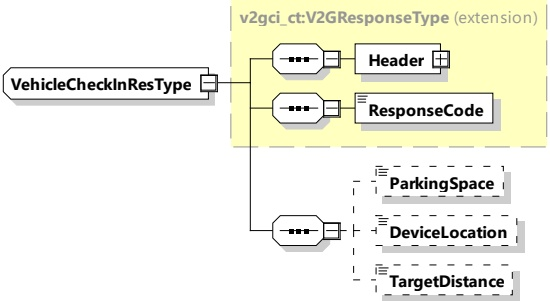

such as "VehicleFrame" and "ParkingSpace" will have a chance to be applied to the EV geometry and direction check within a parking lot in some cases.

######## 8.3.4.8.1.1.3 VehicleCheckInRes

[V2G20-1299] The EVCC and the SECC shall implement the message elements as defined in Table 91 and Figure 95.

Figure 95 — Schema diagram - VehicleCheckInRes

The elements of this message are used according to Table 91.

Table 91 — Semantics and type definition for VehicleCheckInRes

<table border=1 style='margin: auto; word-wrap: break-word;'><tr><td style='text-align: center; word-wrap: break-word;'>Element Name</td><td style='text-align: center; word-wrap: break-word;'>Type</td><td style='text-align: center; word-wrap: break-word;'>Semantics</td></tr><tr><td style='text-align: center; word-wrap: break-word;'>Header</td><td style='text-align: center; word-wrap: break-word;'>complexType: MessageHeaderType refer to 8.3.3</td><td style='text-align: center; word-wrap: break-word;'>Contains general information, used for all messages.</td></tr><tr><td style='text-align: center; word-wrap: break-word;'>ResponseCode</td><td style='text-align: center; word-wrap: break-word;'>simpleType: responseCodeType enumeration refer to Annex A for the type definition</td><td style='text-align: center; word-wrap: break-word;'>ResponseCode indicating the acknowledgment status of any of the V2G messages received by the SECC.</td></tr><tr><td style='text-align: center; word-wrap: break-word;'>ParkingSpace</td><td style='text-align: center; word-wrap: break-word;'>simpleType: xs:short</td><td style='text-align: center; word-wrap: break-word;'>Optional: This element provides the information about 2 dimensional parking space, given by (ParkingWidth, ParkingLength).</td></tr><tr><td style='text-align: center; word-wrap: break-word;'>DeviceLocation</td><td style='text-align: center; word-wrap: break-word;'>simpleType: xs:short</td><td style='text-align: center; word-wrap: break-word;'>Optional: This element provides information of parking WPT device location in parking space, given by (LocationWidth, LocationLength).</td></tr><tr><td style='text-align: center; word-wrap: break-word;'>TargetDistance</td><td style='text-align: center; word-wrap: break-word;'>simpleType: xs:short</td><td style='text-align: center; word-wrap: break-word;'>Optional: This element provides the distance information between WPT parking device and EV device measured by EVSE, given by (DistanceX, DistanceY).</td></tr></table>