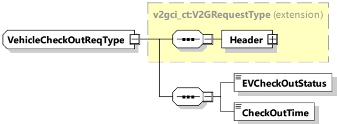

####### 8.3.4.8.1.2 VehicleCheckOutReq/Res

######## 8.3.4.8.1.2.1 VehicleCheckOutReq/Res handling

This message is used by the EVCC to inform the SECC about the departure of the EV. The definition of a charging session includes EV departure, so it is necessary for the SECC to know it. This message is applied to parking status services.

NOTE These messages are part of the parking status service.

######## 8.3.4.8.1.2.2 VehicleCheckOutReq

[V2G20-1300] The EVCC and the SECC shall implement the message elements as defined in Table 92 and Figure 96.

Figure 96 — Schema diagram - VehicleCheckOutReq

The elements of this message are used according to Table 92.

Table 92 — Semantics and type definition for VehicleCheckOutReq

<table border=1 style='margin: auto; word-wrap: break-word;'><tr><td style='text-align: center; word-wrap: break-word;'>Element Name</td><td style='text-align: center; word-wrap: break-word;'>Type</td><td style='text-align: center; word-wrap: break-word;'>Semantics</td></tr><tr><td style='text-align: center; word-wrap: break-word;'>Header</td><td style='text-align: center; word-wrap: break-word;'>complexType:MessageHeaderTyperefer to 8.3.3</td><td style='text-align: center; word-wrap: break-word;'>Contains general information, used for all messages.</td></tr><tr><td style='text-align: center; word-wrap: break-word;'>EVCheckOutStatus</td><td style='text-align: center; word-wrap: break-word;'>simpleType:EVCheckOutStatusTypeenumerationrefer to Annex A for the type definition</td><td style='text-align: center; word-wrap: break-word;'>Set &quot;check out&quot;, &quot;processing&quot; or &quot;completed&quot;This element is used to inform to the SECC the CheckOut status.</td></tr><tr><td style='text-align: center; word-wrap: break-word;'>CheckOutTime</td><td style='text-align: center; word-wrap: break-word;'>simpleType:xs:unsignedLong</td><td style='text-align: center; word-wrap: break-word;'>This element is used to inform to the SECC about the planned/estimated/expected departure time of the EV expressed as an absolute time stamp in SECC Time [in seconds].</td></tr></table>

######## 8.3.4.8.1.2.3 VehicleCheckOutRes

[V2G20-1301] The EVCC and the SECC shall implement the message elements as defined in Table 93 and Figure 97.