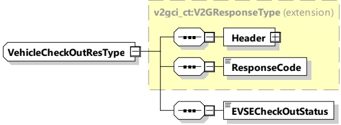

Figure 97 — Schema diagram - VehicleCheckOutRes

Table 93 — Semantics and type definition for VehicleCheckOutRes

<table border=1 style='margin: auto; word-wrap: break-word;'><tr><td style='text-align: center; word-wrap: break-word;'>Element Name</td><td style='text-align: center; word-wrap: break-word;'>Type</td><td style='text-align: center; word-wrap: break-word;'>Semantics</td></tr><tr><td style='text-align: center; word-wrap: break-word;'>Header</td><td style='text-align: center; word-wrap: break-word;'>complexType:MessageHeaderTyperefer to 8.3.3</td><td style='text-align: center; word-wrap: break-word;'>Contains general information, used for all messages.</td></tr><tr><td style='text-align: center; word-wrap: break-word;'>ResponseCode</td><td style='text-align: center; word-wrap: break-word;'>simpleType:responseCodeTypeenumerationrefer to Annex A for the type definition</td><td style='text-align: center; word-wrap: break-word;'>ResponseCode indicating the acknowledgment status of any of the V2G messages received by the SECC.</td></tr><tr><td style='text-align: center; word-wrap: break-word;'>EVSECheckOutStatus</td><td style='text-align: center; word-wrap: break-word;'>simpleType:evseCheckOutStatusTypeenumerationrefer to Annex A for the type definition</td><td style='text-align: center; word-wrap: break-word;'>Set &quot;scheduled&quot; or &quot;completed&quot;. This element is used to inform to the EVCC the CheckOut status.</td></tr></table>

#### 8.3.5 Complex data types

##### 8.3.5.1 Overview

This subclause defines complex data types (complexType), which are used in the messages. Complex data types are composed of several elements which themselves are based on simple data types.

NOTE Types starting with xs: are defined by W3C XML Schema 2 documents.

##### 8.3.5.2 Physical Values

[V2G20-1813] The absolute value of the element defining the maximum shall always be greater than the absolute value defining the matching minimum, e.g. EVMaximumChargePower and EVMimimumChargeCurrent. This relationship shall also be maintained if the values of an element pair get communicated in two different messages.

[V2G20-1204] For all message elements of type RationalNumberType the SECC and the EVCC shall apply the value range and unit definition as according to Table 94.

Table 94 — Value range and unit definition for message elements using RationalNumberType

<table border=1 style='margin: auto; word-wrap: break-word;'><tr><td style='text-align: center; word-wrap: break-word;'>Element Name</td><td style='text-align: center; word-wrap: break-word;'>Physical unit</td></tr><tr><td style='text-align: center; word-wrap: break-word;'>BatteryEnergyCapacity</td><td style='text-align: center; word-wrap: break-word;'>Wh</td></tr><tr><td style='text-align: center; word-wrap: break-word;'>EVEnergyRequest</td><td style='text-align: center; word-wrap: break-word;'>Wh</td></tr><tr><td style='text-align: center; word-wrap: break-word;'>EVMaximumChargeCurrent</td><td style='text-align: center; word-wrap: break-word;'>A</td></tr></table>

Copied with the permission of ANSI on behalf of ISO in connection with USDOT National Electric Vehicle Infrastructure (NEVI) Formula Program. Copying not permitted. ©ISO. All rights reserved.