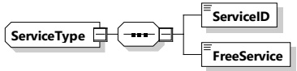

NOTE 1 This means that the SECC is allowed to reach a target range defined between EV maximum energy level and EV target energy level.

NOTE 2 When the EVMaximumEnergyRequest value is negative then an immediate discharge is requested by the EV.

EVMinimumEnergyRequest is used to indicate the minimum amount of energy requested by the EV at any given time during the energy transfer loop. It is the difference between the minimum level of energy requested by the EV to be transferred as soon as possible and the present level of energy of the EV battery.

NOTE 3 When the EVMinimumEnergyRequest value is positive then an immediate charge is requested by the EV.

NOTE 4 When the EVMinimumEnergyRequest value is equal to zero or negative then charging can be delayed or discharging can be applied.

EVMaximumEnergyRequest is used to indicate the maximum energy level accepted by the EV at any given time during the energy transfer loop. It is the difference between the maximum level of energy accepted by the EV and the present level of energy of the EV battery.

EVTargetEnergyRequest is used to indicate the amount of energy requested by the EV before departure time. It is the difference between the amount of energy required by the EV at departure time and the present level of energy in the EV battery.

NOTE 5 When the EVMinimumEnergyRequest value is equal to zero or negative and the EVMaximumEnergyRequest value is equal to zero or positive then charging or discharging is possible.

Since the energy request values get constantly updated by the EV to the actual conditions this mechanism allows to compensate for auxiliary energy demand (e.g. due to cabin heating or cooling) that over time will drain the storage system. Such type of energy "leakage" would be reflected in a reduced EV present energy level, which then would be reflected by adjusted EV[*]EnergyRequest parameters. The SECC gets a chance to derive educated guesses on leakage behavior and can include such assumptions in its energy transfer strategy. On the other hand the EVCC should include a known leakage energy demand in its energy request description as early as possible to give the SECC a better foundation for planning its strategy.

##### 8.3.5.3 Common

###### 8.3.5.3.1 ServiceType

This type represents a tag for a specific service. It gives a short definition and identification of a specific service.

[V2G20-1308]

The SECC and the EVCC shall implement this type as defined in Table 95 and Figure 98.

Figure 98 — Schema diagram - ServiceType

The elements of this message are used according to Table 95.

Table 95 — Semantics and type definition for ServiceType

## 244 

Copied with the permission of ANSI on behalf of ISO in connection with USDOT National Electric Vehicle Infrastructure (NEVI) Formula Program. Copying not permitted. ©ISO. All rights reserved.