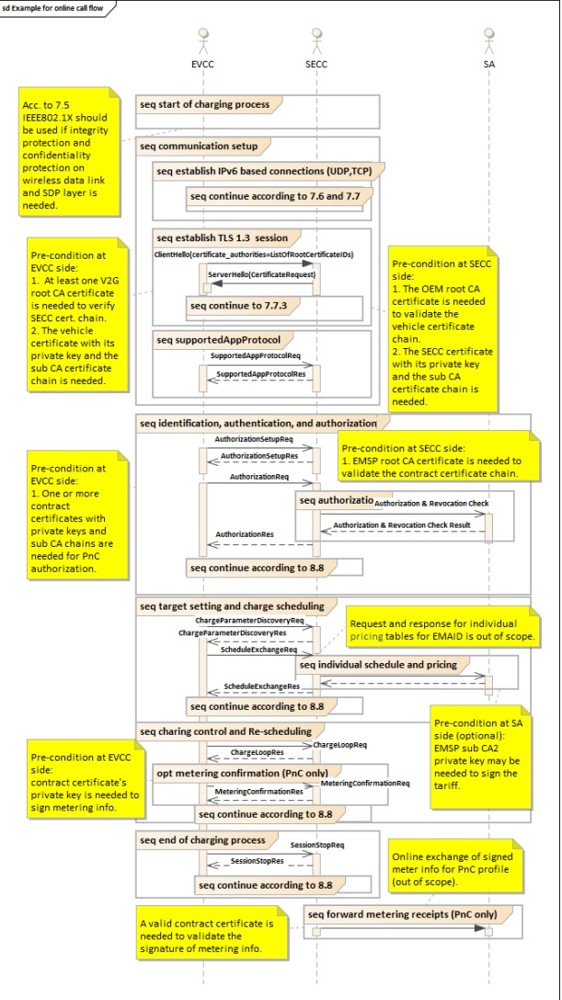

NOTE The communication between SECC and SA in Figure 4 is shown for informational purpose only and not intended to specify a particular message sequence.

Figure 4 — Example for call flows

There are further use cases where security mechanisms are needed on application layer. These are the initial enrollment/installation of contract certificates and keys as well as the update of the contract certificates and keys. In this case vehicle specific OEM keys are used. Those mechanisms are described in 7.9.2.5. An overview on all needed certificates can be found in Annex B.