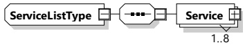
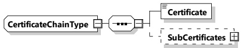

<table border=1 style='margin: auto; word-wrap: break-word;'><tr><td style='text-align: center; word-wrap: break-word;'>Element Name</td><td style='text-align: center; word-wrap: break-word;'>Type</td><td style='text-align: center; word-wrap: break-word;'>Semantics</td></tr><tr><td style='text-align: center; word-wrap: break-word;'>ServiceID</td><td style='text-align: center; word-wrap: break-word;'>simpleType:xs:unsignedShort</td><td style='text-align: center; word-wrap: break-word;'>Unique identifier of the service</td></tr><tr><td style='text-align: center; word-wrap: break-word;'>FreeService</td><td style='text-align: center; word-wrap: break-word;'>simpleType:xs:boolean</td><td style='text-align: center; word-wrap: break-word;'>This element is used by the SECC to indicate if a service can be used by the EVCC free of charge or not. If FreeService is equal to true, the EV can use the offered service without an additional cost. If FreeService is equal to false, the service, if used by the EV, will be billed using the method negotiated during the authorization phase.</td></tr></table>

###### 8.3.5.3.2 ServiceListType

[V2G20-1309] The SECC and the EVCC shall implement this type as defined in Table 96 and Figure 99.

Figure 99 — Schema diagram - ServiceListType

The elements of this message are used according to Table 96.

Table 96 — Semantics and type definition for ServiceListType

<table border=1 style='margin: auto; word-wrap: break-word;'><tr><td style='text-align: center; word-wrap: break-word;'>Element Name</td><td style='text-align: center; word-wrap: break-word;'>Type</td><td style='text-align: center; word-wrap: break-word;'>Semantics</td></tr><tr><td rowspan="3">Service</td><td style='text-align: center; word-wrap: break-word;'>complexType:</td><td rowspan="3">Contains all information for identifying a service. The ServiceList includes at least one service and may include up to 8 services.</td></tr><tr><td style='text-align: center; word-wrap: break-word;'>serviceType</td></tr><tr><td style='text-align: center; word-wrap: break-word;'>refer to 8.3.5.3.1</td></tr></table>

###### 8.3.5.3.3 CertificateChainType

This data type stores the leaf certificate, and all certificates in the chain up to the root. The root certificate is not included in this data type. In the special (but unlikely) case, that a leaf certificate is directly signed by the root, the "SubCertificates" field is empty. In all other cases, this field contains an ordered list of sub-CA certificates to follow the trust-path from the leaf certificate up to the root.

[V2G20-1312] The SECC and the EVCC shall implement this type as defined in Table 97 and Figure 100.

Figure 100 — Schema diagram - CertificateChainType

The elements of this message are used according to Table 97.