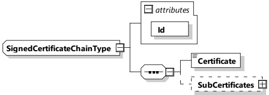

Table 97 — Semantics and type definition for CertificateChainType

<table border=1 style='margin: auto; word-wrap: break-word;'><tr><td style='text-align: center; word-wrap: break-word;'>Element Name</td><td style='text-align: center; word-wrap: break-word;'>Type</td><td style='text-align: center; word-wrap: break-word;'>Semantics</td></tr><tr><td style='text-align: center; word-wrap: break-word;'>Certificate</td><td style='text-align: center; word-wrap: break-word;'>simpleType:certificateTyperefer to Annex A for the type definition</td><td style='text-align: center; word-wrap: break-word;'>A x.509v3 leaf certificate (the &quot;client&quot; certificate). The certificate is DER encoded.Refer to ITU-T X.690 for details of DER encoding.</td></tr><tr><td style='text-align: center; word-wrap: break-word;'>SubCertificates</td><td style='text-align: center; word-wrap: break-word;'>complexType:SubCertificatesTyperefer to 8.3.5.3.6</td><td style='text-align: center; word-wrap: break-word;'>Optional:The certificate chain containing all sub-certificates leading up to the CA certificate, but not including the root CA certificate</td></tr></table>

[V2G20-2683] If the certificate provided in element "Certificate" included in the parameter of "CertificateChainType" is not directly signed by a root CA certificate, element "SubCertificates" shall be included in the parameter of "CertificateChainType".

NOTE If the certificate included in element "Certificate" is directly signed by a root CA certificate, element "SubCertificates" is not included in the parameter of "CertificateChainType".

###### 8.3.5.3.4 SignedCertificateChainType

This data type stores the leaf certificate, and all certificates in the chain up to the root. The root certificate is not included in this data type. In the special (but unlikely) case, that a leaf certificate is directly signed by the root, the "SubCertificates" field is empty. In all other cases, this field contains an ordered list of sub-CA-certificates to follow the trust-path from the leaf certificate up to the root. In addition to 8.3.5.3.3, this element may be signed, since an Id attribute is included.

[V2G20-1312] The SECC and the EVCC shall implement this type as defined in Table 98 and Figure 101.

Figure 101 — Schema diagram - SignedCertificateChainType

The elements of this message are used according to Table 98.

Table 98 — Semantics and type definition for SignedCertificateChainType

<table border=1 style='margin: auto; word-wrap: break-word;'><tr><td style='text-align: center; word-wrap: break-word;'>Element Name</td><td style='text-align: center; word-wrap: break-word;'>Type</td><td style='text-align: center; word-wrap: break-word;'>Semantics</td></tr><tr><td style='text-align: center; word-wrap: break-word;'>Id</td><td style='text-align: center; word-wrap: break-word;'>Attribute</td><td style='text-align: center; word-wrap: break-word;'>Allows inclusion of this element into a signature.</td></tr><tr><td style='text-align: center; word-wrap: break-word;'>Certificate</td><td style='text-align: center; word-wrap: break-word;'>simpleType: certificateType refer to Annex A for the type definition</td><td style='text-align: center; word-wrap: break-word;'>A x.509v3 leaf certificate (the &quot;client&quot; certificate). The certificate is DER encoded. Refer to ITU-T X690 for details of DER encoding.</td></tr></table>