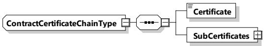
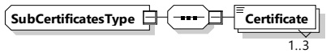

<table border=1 style='margin: auto; word-wrap: break-word;'><tr><td rowspan="2">SubCertificates</td><td style='text-align: center; word-wrap: break-word;'>complexType:</td><td style='text-align: center; word-wrap: break-word;'>Optional:</td></tr><tr><td style='text-align: center; word-wrap: break-word;'>SubCertificatesType refer to 8.3.5.3.6</td><td style='text-align: center; word-wrap: break-word;'>The chain with all subcertificates to the root certificate (not including root certificate).</td></tr></table>

###### 8.3.5.3.5 ContractCertificateChainType

[V2G20-1859] The SECC and the EVCC shall implement this type as defined in Figure 102 and Table 99.

Figure 102 — Schema diagram - ContractCertificateChainType

The elements of this message are used according to Table 99.

Table 99 — Semantics and type definition for ContractCertificateChainType

<table border=1 style='margin: auto; word-wrap: break-word;'><tr><td style='text-align: center; word-wrap: break-word;'>Element Name</td><td style='text-align: center; word-wrap: break-word;'>Type</td><td style='text-align: center; word-wrap: break-word;'>Semantics</td></tr><tr><td style='text-align: center; word-wrap: break-word;'>Certificate</td><td style='text-align: center; word-wrap: break-word;'>simpleType:certificateTyperefer to Annex A for the type definition</td><td style='text-align: center; word-wrap: break-word;'>An x.509v3 certificate (the &quot;client&quot; certificate). The certificate is DER encoded.</td></tr><tr><td style='text-align: center; word-wrap: break-word;'>SubCertificates</td><td style='text-align: center; word-wrap: break-word;'>complexType:SubCertificatesTyperefer to 8.3.5.3.6</td><td style='text-align: center; word-wrap: break-word;'>The chain with all subcertificates to the root-certificate (not including root certificate).</td></tr></table>

###### 8.3.5.3.6 SubCertificatesType

[V2G20-1336] The SECC and the EVCC shall implement this type as defined in Table 100 and Figure 103.

Figure 103 — Schema diagram - SubCertificatesType

The elements of this message are used according to Table 100.

Table 100 — Semantics and type definition for SubCertificatesType

<table border=1 style='margin: auto; word-wrap: break-word;'><tr><td style='text-align: center; word-wrap: break-word;'>Element Name</td><td style='text-align: center; word-wrap: break-word;'>Type</td><td style='text-align: center; word-wrap: break-word;'>Semantics</td></tr><tr><td style='text-align: center; word-wrap: break-word;'>Certificate</td><td style='text-align: center; word-wrap: break-word;'>simpleType: certificateType refer to Annex A for the type definition</td><td style='text-align: center; word-wrap: break-word;'>An x.509v3 certificate. The certificate is DER encoded. Number of occurrences is limited to three.</td></tr></table>

###### 8.3.5.3.7 MeterInfoType