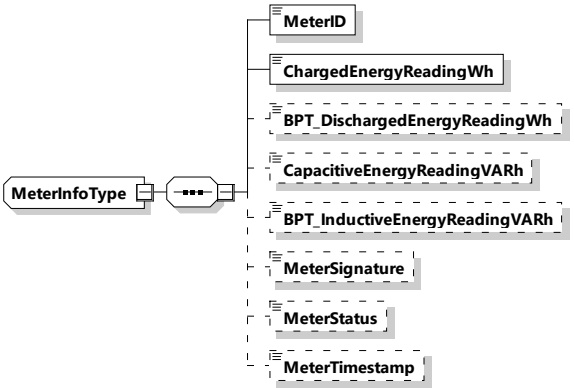

[V2G20-1313]

The SECC and the EVCC shall implement this type as defined in Table 101 and Figure 104.

Figure 104 — Schema diagram - MeterInfoType

The elements of this message are used according to Table 101.

Table 101 — Semantics and type definition for MeterInfoType

<table border=1 style='margin: auto; word-wrap: break-word;'><tr><td style='text-align: center; word-wrap: break-word;'>Element Name</td><td style='text-align: center; word-wrap: break-word;'>Type</td><td style='text-align: center; word-wrap: break-word;'>Semantics</td></tr><tr><td style='text-align: center; word-wrap: break-word;'>MeterID</td><td style='text-align: center; word-wrap: break-word;'>simpleType: meterIDType refer to Annex A for the type definition</td><td style='text-align: center; word-wrap: break-word;'>Unique identifier of the EVSE meter.</td></tr><tr><td style='text-align: center; word-wrap: break-word;'>ChargedEnergyReadingWh</td><td style='text-align: center; word-wrap: break-word;'>simpleType: xs:unsignedLong</td><td style='text-align: center; word-wrap: break-word;'>The meter reading in Watthours that counts the energy flow from the EVSE to the EV, which is related to the normal charging process. The value is not guaranteed to start at zero during every energy transfer session.</td></tr><tr><td style='text-align: center; word-wrap: break-word;'>BPT_DischargedEnergyReadingWh</td><td style='text-align: center; word-wrap: break-word;'>simpleType: xs:unsignedLong</td><td style='text-align: center; word-wrap: break-word;'>Optional for BPT, not applicable for other energy transfer services: The meter reading in Watthours that counts the energy flow from the EV to the EVSE, which is related to the discharging process. The value is not guaranteed to start at zero during every energy transfer session.</td></tr><tr><td style='text-align: center; word-wrap: break-word;'>CapacitiveEnergyReadingVARh</td><td style='text-align: center; word-wrap: break-word;'>simpleType: xs:unsignedLong</td><td style='text-align: center; word-wrap: break-word;'>Optional: The meter reading in volt-ampere-reactive-hour (varh) which reflects the amount of capacitive reactive energy exchanged with the grid. The value is not guaranteed to start at zero during every energy transfer session.</td></tr></table>