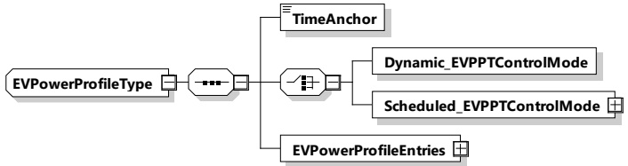

Figure 105 — Schema diagram - RationalNumberType

The elements of this message are used according to Table 102.

Table 102 — Semantics and type definition for RationalNumberType

<table border=1 style='margin: auto; word-wrap: break-word;'><tr><td style='text-align: center; word-wrap: break-word;'>Element Name</td><td style='text-align: center; word-wrap: break-word;'>Type</td><td style='text-align: center; word-wrap: break-word;'>Semantics</td></tr><tr><td style='text-align: center; word-wrap: break-word;'>Exponent (exp)</td><td style='text-align: center; word-wrap: break-word;'>simpleType: ExponentType xs:byte</td><td style='text-align: center; word-wrap: break-word;'>The exponent to base 10 (dec). The final physical value is determined by:  $ x_{\text{RationalNumberType}} = y \times 10^{\text{exp}} $</td></tr><tr><td style='text-align: center; word-wrap: break-word;'>Value (y)</td><td style='text-align: center; word-wrap: break-word;'>simpleType xs:short</td><td style='text-align: center; word-wrap: break-word;'>Value which shall be multiplied</td></tr></table>

NOTE For more information on the aspect of measurement tolerances of RationalNumberType elements see Annex I.

###### 8.3.5.3.9 EVPowerProfileType

[V2G20-1316] The SECC and the EVCC shall implement this type as defined in Table 103 and Figure 106.

Figure 106 — Schema diagram - EVPowerProfileType

The elements of this message are used according to Table 103.

Table 103 — Semantics and type definition for EVPowerProfileType

<table border=1 style='margin: auto; word-wrap: break-word;'><tr><td style='text-align: center; word-wrap: break-word;'>Element Name</td><td style='text-align: center; word-wrap: break-word;'>Type</td><td style='text-align: center; word-wrap: break-word;'>Semantics</td></tr><tr><td style='text-align: center; word-wrap: break-word;'>TimeAnchor</td><td style='text-align: center; word-wrap: break-word;'>simpleType:xs:unsignedLong</td><td style='text-align: center; word-wrap: break-word;'>The time that defines the starting point for the first EVPowerProfileEntry in this power profile.The value is encoded at microseconds resolution in SECC time, a concept that is defined in 8.3.3.3.Commonly the TimeAnchor will define a time that either is the present or some point in the near future.</td></tr></table>