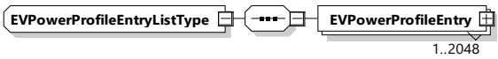

<table border=1 style='margin: auto; word-wrap: break-word;'><tr><td style='text-align: center; word-wrap: break-word;'>Element Name</td><td style='text-align: center; word-wrap: break-word;'>Type</td><td style='text-align: center; word-wrap: break-word;'>Semantics</td></tr><tr><td style='text-align: center; word-wrap: break-word;'>Dynamic_EVPPTControlMode</td><td style='text-align: center; word-wrap: break-word;'>complexType:Dynamic_EVPPTControlModeTyperefer to 8.3.5.3.11</td><td style='text-align: center; word-wrap: break-word;'>Contains all elements that are only required in case the control mode &quot;Dynamic&quot; is chosen.</td></tr><tr><td style='text-align: center; word-wrap: break-word;'>Scheduled_EVPPTControlMode</td><td style='text-align: center; word-wrap: break-word;'>complexType:Scheduled_EVPPTControlModeTyperefer to 8.3.5.3.11</td><td style='text-align: center; word-wrap: break-word;'>Contains all elements that are only required in case the control mode &quot;Scheduled&quot; is chosen.</td></tr><tr><td style='text-align: center; word-wrap: break-word;'>EVPowerProfileEntries</td><td style='text-align: center; word-wrap: break-word;'>complexType:EVPowerProfileEntryListTyperefer to 8.3.5.3.10</td><td style='text-align: center; word-wrap: break-word;'>Element used for encapsulating an individual power profile entry of the charge schedule. The number of EVPowerProfileEntry elements is limited to 2048.</td></tr></table>

[V2G20-1861] The TimeAnchor element shall defined the point in time when the first EVPowerProfileEntry element starts to be active.

[V2G20-1559] The power values of the EVPowerProfileEntry elements at no time shall exceed the corresponding hard limits of the power boundaries defined by the PowerSchedule and PowerDischargeSchedule of the last correctly negotiated ScheduleTuple which was selected by the EV during the related ScheduleExchangeReq/Res phase.

[V2G20-1010] The power values of the EVPowerProfileEntry elements shall represent the projected average target power levels.

NOTE 1 An average target power value allows the SECC to guess the required energy per EVPowerProfileEntry.

NOTE 2 As the EVPowerProfile can communicate charging and discharging phases at the same time the power values can be either positive or negative.

###### 8.3.5.3.10 EVPowerProfileEntryListType

[V2G20-1867] The SECC and the EVCC shall implement this type as defined in Figure 107 and Table 104.

## Figure 107 — Schema diagram - EVPowerProfileEntryListType

The elements of this message are used according to Table 104.

Table 104 — Semantics and type definition for EVPowerProfileEntryListType

<table border=1 style='margin: auto; word-wrap: break-word;'><tr><td style='text-align: center; word-wrap: break-word;'>Element Name</td><td style='text-align: center; word-wrap: break-word;'>Type</td><td style='text-align: center; word-wrap: break-word;'>Semantics</td></tr><tr><td style='text-align: center; word-wrap: break-word;'>EVPowerProfileEntry</td><td style='text-align: center; word-wrap: break-word;'>complexType:PowerScheduleEntryTyperefer to 8.3.5.3.20</td><td style='text-align: center; word-wrap: break-word;'>List of EVPowerProfileEntry elements.The maximum amount of elements shall be 2 048.</td></tr></table>

###### 8.3.5.3.11 Dynamic_EVPPTControlModeType