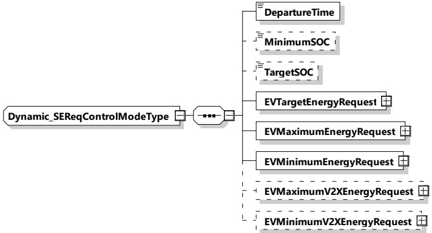

###### 8.3.5.3.13 Dynamic_SEReqControlModeType

This type contains all elements of the ScheduleExchangeReq message that are only required in case the control mode "Dynamic" is chosen.

[V2G20-1755]

The SECC and the EVCC shall implement this type as defined in Table 107 and Figure 110.

Figure 110 — Schema diagram - Dynamic_SEReqControlModeType

The elements of this message are used according to Table 107.

Table 107 — Semantics and type definition for Dynamic_SEReqControlModeType

<table border=1 style='margin: auto; word-wrap: break-word;'><tr><td style='text-align: center; word-wrap: break-word;'>Element Name</td><td style='text-align: center; word-wrap: break-word;'>Type</td><td style='text-align: center; word-wrap: break-word;'>Semantics</td></tr><tr><td style='text-align: center; word-wrap: break-word;'>DepartureTime</td><td style='text-align: center; word-wrap: break-word;'>simpleType:xs:unsignedInt</td><td style='text-align: center; word-wrap: break-word;'>This element is used to indicate when the EV intends to finish the energy transfer process.The value is encoded in seconds since the TimeStamp of the message header (see [V2G20-2104]).</td></tr><tr><td style='text-align: center; word-wrap: break-word;'>MinimumSOC</td><td style='text-align: center; word-wrap: break-word;'>simpleType:percentValueTyperefer to Annex A for the type definition</td><td style='text-align: center; word-wrap: break-word;'>Optional:Minimum State of Charge EV needs to keep throughout the charging session.Mandatory when service parameter MobilityNeedsMode was set to 2.</td></tr><tr><td style='text-align: center; word-wrap: break-word;'>TargetSOC</td><td style='text-align: center; word-wrap: break-word;'>simpleType:percentValueTyperefer to Annex A for the type definition</td><td style='text-align: center; word-wrap: break-word;'>Optional:Target State of Charge of the EV Battery EV needs after charging.Mandatory when service parameter MobilityNeedsMode was set to 2.</td></tr><tr><td style='text-align: center; word-wrap: break-word;'>EVTargetEnergyRequest</td><td style='text-align: center; word-wrap: break-word;'>complexType:RationalNumberTyperefer to 8.3.5.3.8</td><td style='text-align: center; word-wrap: break-word;'>The energy request of the EV it needs to fulfil the target SOC as specified by the owner.</td></tr></table>