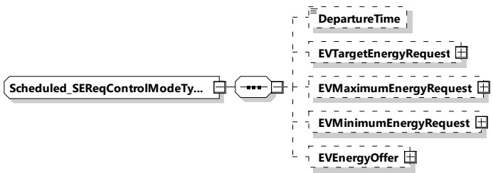

Figure 111 — Schema diagram - Scheduled_SEReqControlModeType

The elements of this message are used according to Table 108.

Table 108 — Semantics and type definition for scheduled_SEReqControlModeType

<table border=1 style='margin: auto; word-wrap: break-word;'><tr><td style='text-align: center; word-wrap: break-word;'>Element Name</td><td style='text-align: center; word-wrap: break-word;'>Type</td><td style='text-align: center; word-wrap: break-word;'>Semantics</td></tr><tr><td style='text-align: center; word-wrap: break-word;'>DepartureTime</td><td style='text-align: center; word-wrap: break-word;'>simpleType:xs:unsignedInt</td><td style='text-align: center; word-wrap: break-word;'>Optional:This element is used to indicate when the EV intends to finish the energy transfer process.The value is encoded in seconds since the TimeStamp of the message header (see [V2G20-2104]).</td></tr><tr><td style='text-align: center; word-wrap: break-word;'>EVTargetEnergyRequest</td><td style='text-align: center; word-wrap: break-word;'>complexType:RationalNumberTyperefer to 8.3.5.3.8</td><td style='text-align: center; word-wrap: break-word;'>Optional:The energy request of the EV it needs to fulfil the target SOC as specified by the owner.</td></tr><tr><td style='text-align: center; word-wrap: break-word;'>EVMaximumEnergyRequest</td><td style='text-align: center; word-wrap: break-word;'>complexType:RationalNumberTyperefer to 8.3.5.3.8</td><td style='text-align: center; word-wrap: break-word;'>Optional:Maximum acceptable energy level of the EV.</td></tr><tr><td style='text-align: center; word-wrap: break-word;'>EVMinimumEnergyRequest</td><td style='text-align: center; word-wrap: break-word;'>complexType:RationalNumberTyperefer to 8.3.5.3.8</td><td style='text-align: center; word-wrap: break-word;'>Optional:The energy request of the EV it needs to fulfil the minimum SOC as specified by the owner.</td></tr><tr><td style='text-align: center; word-wrap: break-word;'>EVEnergyOffer</td><td style='text-align: center; word-wrap: break-word;'>complexType:EVEnergyOfferTyperefer to 8.3.5.3.41</td><td style='text-align: center; word-wrap: break-word;'>Optional:Includes several tuples of schedules from the EV.</td></tr></table>

NOTE If the EVTargetEnergyRequest has a negative value and the EVCC communicates an EVEnergyOffer, it is to be set as the amount of Energy the EV offers in the EVEnergyOffer at a certain price per kWh at a certain power-over-time.

###### 8.3.5.3.15 Dynamic_SEResControlModeType

This type contains all elements of the ScheduleExchangeRes message that are only required in case the control mode "Dynamic" is chosen.

[V2G20-1868]

The SECC and the EVCC shall implement this type as defined in Table 109 and Figure 112.

