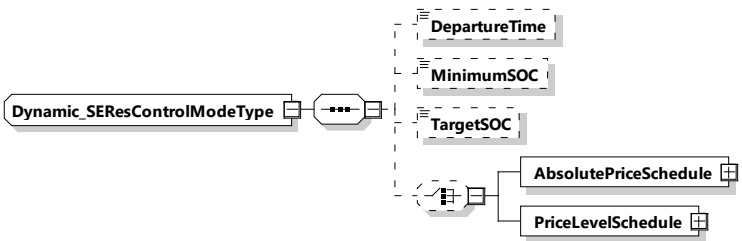

Figure 112 — Schema diagram - Dynamic_SEResControlModeType

The elements of this message are used according to Table 109.

Table 109 — Semantics and type definition for Dynamic_SEResControlModeType

<table border=1 style='margin: auto; word-wrap: break-word;'><tr><td style='text-align: center; word-wrap: break-word;'>Element Name</td><td style='text-align: center; word-wrap: break-word;'>Type</td><td style='text-align: center; word-wrap: break-word;'>Semantics</td></tr><tr><td style='text-align: center; word-wrap: break-word;'>DepartureTime</td><td style='text-align: center; word-wrap: break-word;'>simpleType: xs:unsignedInt</td><td style='text-align: center; word-wrap: break-word;'>Optional: This element is used to indicate when the EV intends to finish the charging process Only used when service parameter MobilityNeedsMode was set to 2. The value is encoded in seconds since the TimeStamp of the message header (see [V2G20-2104]).</td></tr><tr><td style='text-align: center; word-wrap: break-word;'>TargetSOC</td><td style='text-align: center; word-wrap: break-word;'>simpleType: percentValueType refer to Annex A for the type definition</td><td style='text-align: center; word-wrap: break-word;'>Optional: New TargetSOC value updated by the user from EVSE&#x27;s side Only used when service parameter MobilityNeedsMode was set to 2.</td></tr><tr><td style='text-align: center; word-wrap: break-word;'>MinimumSOC</td><td style='text-align: center; word-wrap: break-word;'>simpleType: percentValueType refer to Annex A for the type definition</td><td style='text-align: center; word-wrap: break-word;'>Optional: New MinimumSOC value updated by the user from EVSE&#x27;s side Only used when service parameter MobilityNeedsMode was set to 2.</td></tr><tr><td style='text-align: center; word-wrap: break-word;'>AbsolutePriceSchedule</td><td style='text-align: center; word-wrap: break-word;'>complexType: AbsolutePriceScheduleType refer to 8.3.5.3.49</td><td style='text-align: center; word-wrap: break-word;'>Optional: Absolute price schedule for this session.</td></tr><tr><td style='text-align: center; word-wrap: break-word;'>PriceLevelSchedule</td><td style='text-align: center; word-wrap: break-word;'>complexType: PriceLevelScheduleType refer to 8.3.5.3.62</td><td style='text-align: center; word-wrap: break-word;'>Optional: PriceLevel schedule for this session.</td></tr></table>

[V2G20-1640] The SECC shall only send MinimumSOC that is less than or equal to TargetSOC.

[V2G20-2660] If the EVCC selected the service parameter "MobilityNeedsMode" set to 2 and the SECC received new values for departure time, target SOC or minimum SOC from a secondary actor, the SECC shall include those updated values in DepartureTime, TargetSOC or MinimumSOC, respectively.

[V2G20-1648] If the EVCC selected the service parameter MobilityNeedsMode set to 2 and the EVCC receives a ScheduleExchangeRes with DepartureTime, TargetSOC or MinimumSOC in Dynamic_SEResControlMode, and if the EVCC accepts this DepartureTime,