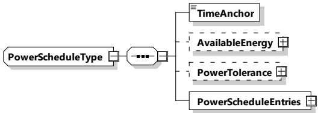

NOTE 8 This allows the EVCC to verify the integrity of the sales tariff by performing unique SECC verification. SECC/SA implementation is supposed to use the EVCC contract certificate chain which was transmitted in the element ContractCertificateChain of the message AuthorizationReq to identify the private key which can be used for signing the PriceSchedule. This requirement could be fulfilled by cooperation between SECC and SA including online communication; or the signed PriceSchedule can be cached.

[V2G20-907] In case of PnC, the EVCC, after receiving the PriceSchedule, should verify the signature using the same sub-CA certificate that was used to issue the contract certificate that the EVCC previously used during authorization. If this verification fails, the EVCC may treat the PriceSchedule as invalid. See [V2G20-1569].

NOTE 9 In case of EIM, the EVCC can ignore the signature (if it exists).

[V2G20-1569] If the EVCC treats the PriceSchedule as invalid, it shall ignore the PriceSchedule, i.e. the behavior of the EVCC shall be the same as if this invalid PriceSchedule was not received. Furthermore, the EVCC may close the connection. It then may reopen the connection again.

[V2G20-1869] The pricing within one ScheduleTupleID shall be consistent.

8.3.5.3.18 PowerScheduleType

[V2G20-310] The SECC and the EVCC shall implement this type as defined in Table 112 and Figure 115.

Figure 115 — Schema diagram - PowerScheduleType

The elements of this message are used according to Table 112.

Table 112 — Semantics and type definition for PowerScheduleType

<table border=1 style='margin: auto; word-wrap: break-word;'><tr><td style='text-align: center; word-wrap: break-word;'>Element Name</td><td style='text-align: center; word-wrap: break-word;'>Type</td><td style='text-align: center; word-wrap: break-word;'>Semantics</td></tr><tr><td style='text-align: center; word-wrap: break-word;'>TimeAnchor</td><td style='text-align: center; word-wrap: break-word;'>simpleType:xs:unsignedLong</td><td style='text-align: center; word-wrap: break-word;'>The time that defines the starting point for the first PowerScheduleEntry in this power schedule.The value is encoded at ms resolution in SECC time, a concept that is defined in 8.3.3.2.For use cases that involve external secondary actors SECC time would be aligned with UTC. Commonly the TimeAnchor will define some point in time that lies in the past.</td></tr><tr><td style='text-align: center; word-wrap: break-word;'>AvailableEnergy</td><td style='text-align: center; word-wrap: break-word;'>complexType:RationalNumberTyperefer to 8.3.5.3.8</td><td style='text-align: center; word-wrap: break-word;'>Optional:Gives the Available Energy the EVSE can offer with this Schedule.</td></tr></table>