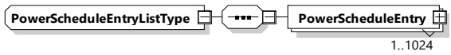

PowerTolerance band at any point in time, is in conflict with the maximum power value provided by the selected PowerSchedule(s) in the latest ScheduleExchangeRes message [V2G20-1559].

NOTE 1 For example, if the requested charge power for a time segment within the EVPowerProfile is 20 kW and PowerTolerance is set to 1.5 kW, the acceptable PowerTolerance band for charging during that segment is (18.5 - 21.5) kW.

Since the EV energy transfer process is impacted by external factors (e.g. environmental conditions) the predictions of the EVPowerProfile are already subject to uncertainty. Therefore, it is not recommended for the SECC to set a too tight PowerTolerance parameter below 5 % of the EVSEMaximumChargePower because it makes unintended violations of the PowerTolerance band more likely.

[V2G20-1871] The parameter PowerTolerance shall be a value greater than zero.

[V2G20-2189] The AvailableEnergy element shall only be included in instances of PowerScheduleType which are describing charging limits within a ChargingSchedule element.

[V2G20-2190] If used in the context of a ChargingSchedule element then the AvailableEnergy element shall only contain values greater than zero.

NOTE 2 For example, the AvailableEnergy information can be used by EVSEs which are part of a micro grid system. It would allow the EVCC to detect very early in the charging process that the desired mobility needs (energy demand) cannot be met.

###### 8.3.5.3.19 PowerScheduleEntryListType

[V2G20-1873] The SECC and the EVCC shall implement this type as defined in Figure 116 and Table 113.

Figure 116 — Schema diagram - PowerScheduleEntryListType

The elements of this message are used according to Table 113.

Table 113 — Semantics and type definition for PowerScheduleEntryListType

<table border=1 style='margin: auto; word-wrap: break-word;'><tr><td style='text-align: center; word-wrap: break-word;'>Element Name</td><td style='text-align: center; word-wrap: break-word;'>Type</td><td style='text-align: center; word-wrap: break-word;'>Semantics</td></tr><tr><td style='text-align: center; word-wrap: break-word;'>PowerScheduleEntry</td><td style='text-align: center; word-wrap: break-word;'>complexType:PowerScheduleEntryTyperefer to8.3.5.3.208.3.5.3.19</td><td style='text-align: center; word-wrap: break-word;'>List of PowerScheduleEntry elements.The number of PowerScheduleEntry elements is limited by the parameterMaximumSupportingPoints (according to[V2G20-1056]).</td></tr></table>

###### 8.3.5.3.20 PowerScheduleEntryType

[V2G20-1320] The SECC and the EVCC shall implement this type as defined in Table 114 and Figure 117.