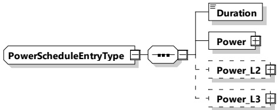

Figure 117 — Schema diagram - PowerScheduleEntryType

The elements of this message are used according to Table 114.

Table 114 — Semantics and type definition for PowerScheduleEntryType

<table border=1 style='margin: auto; word-wrap: break-word;'><tr><td style='text-align: center; word-wrap: break-word;'>Element Name</td><td style='text-align: center; word-wrap: break-word;'>Type</td><td style='text-align: center; word-wrap: break-word;'>Semantics</td></tr><tr><td style='text-align: center; word-wrap: break-word;'>Duration</td><td style='text-align: center; word-wrap: break-word;'>complexType:xs:unsignedInt</td><td style='text-align: center; word-wrap: break-word;'>The amount of seconds that define the duration of the given power schedule entry.</td></tr><tr><td style='text-align: center; word-wrap: break-word;'>Power</td><td style='text-align: center; word-wrap: break-word;'>complexType:RationalNumberTyperefer to 8.3.5.3.8</td><td style='text-align: center; word-wrap: break-word;'>Defines the amount of power (as defined in 8.3.5.3.8) for the given duration.</td></tr><tr><td style='text-align: center; word-wrap: break-word;'>Power_L2</td><td style='text-align: center; word-wrap: break-word;'>complexType:RationalNumberTyperefer to 8.3.5.3.8</td><td style='text-align: center; word-wrap: break-word;'>Optional:Defines the amount of power on phase L2 (as defined in 8.3.5.3.8) for the given duration.</td></tr><tr><td style='text-align: center; word-wrap: break-word;'>Power_L3</td><td style='text-align: center; word-wrap: break-word;'>complexType:RationalNumberTyperefer to 8.3.5.3.8</td><td style='text-align: center; word-wrap: break-word;'>Optional:Defines the amount of power on phase L3 (as defined in 8.3.5.3.8) for the given duration.</td></tr></table>

NOTE 1 The power values of the PowerScheduleEntryType follow the common semantic rules as defined in the clause on the RationalNumberType (8.3.5.3.8), where also the rules for asymmetric polyphase values are provided (8.3.5.2.2). Additional semantic requirements depend on the parent elements which utilize the PowerScheduleEntryType. For more details see the definitions related to: EVPowerProfile, PowerSchedule and PowerDischargeSchedule.

NOTE 2 The precise physical meaning of power is related to the chosen energy transfer technology. Refer to 8.3.5.3.8.

NOTE 3 According to [V2G20-1035] all power values in a DischargingSchedule need to be negative or zero.

[V2G20-1872] The duration element shall define the active period of time (in seconds) for the respective parent element of type PowerScheduleEntryType.

NOTE 4 In a list of consecutive elements the start time of the first PowerScheduleEntryType element is defined by the parent elements which utilize the PowerScheduleEntryType with their TimeAnchor element. See the definitions related to: EVPowerProfile, PowerSchedule and PowerDischargeSchedule.

[V2G20-1874] The start time of each element in a list of consecutive PowerScheduleEntryType elements shall be defined as the point in time when the previous element becomes inactive (see [V2G20-1872]).

[V2G20-1811] Before the start time of the first element and after the last element in a list of elements of type PowerScheduleEntryType becomes inactive the Power[_L2,L3] value shall be defined as the value "zero".