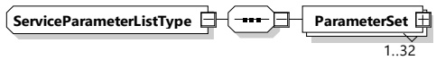
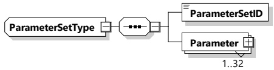

###### 8.3.5.3.21 ServiceParameterListType

[V2G20-1331] The EVCC and the SECC shall implement this type as defined in Table 115 and Figure 118.

Figure 118 — Schema diagram - ServiceParameterListType

The elements of this message are used according to Table 115.

Table 115 — Semantics and type definition for ServiceParameterListType

<table border=1 style='margin: auto; word-wrap: break-word;'><tr><td style='text-align: center; word-wrap: break-word;'>Element Name</td><td style='text-align: center; word-wrap: break-word;'>Type</td><td style='text-align: center; word-wrap: break-word;'>Semantics</td></tr><tr><td rowspan="2">ParameterSet</td><td style='text-align: center; word-wrap: break-word;'>complexType:</td><td rowspan="2">Defines parameters for a specific serviceID received from the SECC in the ServiceDiscoveryRes message.</td></tr><tr><td style='text-align: center; word-wrap: break-word;'>ParameterSetType refer to 8.3.5.3.22</td></tr></table>

###### 8.3.5.3.22 ParameterSetType

[V2G20-1332] The EVCC and the SECC shall implement this type as defined in Table 116 and Figure 119.

Figure 119 — Schema diagram - ParameterSetType

The elements of this message are used according to Table 116.

Table 116 — Semantics and type definition for ParameterSetType

<table border=1 style='margin: auto; word-wrap: break-word;'><tr><td style='text-align: center; word-wrap: break-word;'>Element Name</td><td style='text-align: center; word-wrap: break-word;'>Type</td><td style='text-align: center; word-wrap: break-word;'>Semantics</td></tr><tr><td style='text-align: center; word-wrap: break-word;'>ParameterSetID</td><td style='text-align: center; word-wrap: break-word;'>simpleType:serviceIDTyperefer to Annex A for the type definition</td><td style='text-align: center; word-wrap: break-word;'>This element is used to select a specific parameter set for a specific ServiceID when selecting a service using the ServiceSelectionReq message.</td></tr><tr><td style='text-align: center; word-wrap: break-word;'>Parameter</td><td style='text-align: center; word-wrap: break-word;'>complexType:ParameterTyperefer to 8.3.5.3.23</td><td style='text-align: center; word-wrap: break-word;'>This element is used by the SECC to indicate which service specific parameters can be selected for a certain service using the ParameterSetID.The number of Parameter elements is limited to 32.</td></tr></table>

###### 8.3.5.3.23 ParameterType

[V2G20-1333] The EVCC and the SECC shall implement this type as defined in Table 117 and Figure 120.