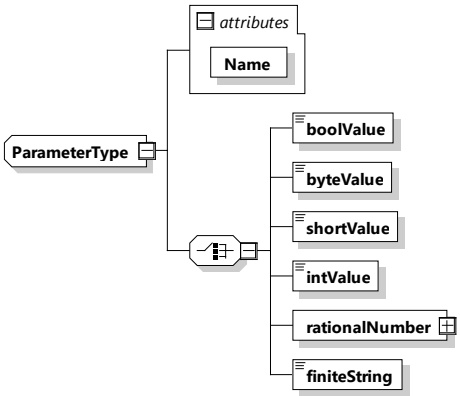
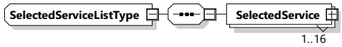

Figure 120 — Schema diagram - ParameterType

The elements of this message are used according to Table 117.

Table 117 — Semantics and type definition for ParameterType

<table border=1 style='margin: auto; word-wrap: break-word;'><tr><td style='text-align: center; word-wrap: break-word;'>Element Name</td><td style='text-align: center; word-wrap: break-word;'>Type</td><td style='text-align: center; word-wrap: break-word;'>Semantics</td></tr><tr><td style='text-align: center; word-wrap: break-word;'>Name</td><td style='text-align: center; word-wrap: break-word;'>simpleType:nameTyperefer to Annex A for the type definition</td><td style='text-align: center; word-wrap: break-word;'>This element is used to indicate the name of the parameter.</td></tr><tr><td style='text-align: center; word-wrap: break-word;'>One of the elements: - boolValue - byteValue - shortValue - intValue - rationalNumber - finiteString</td><td style='text-align: center; word-wrap: break-word;'>xs:boolean (boolValue)xs:byte (byteValue)xs:short (shortValue)xs:int (intValue)nameType (finiteString)refer to Annex A for the type definitionRationalNumberType (rationalNumber)refer to 8.3.5.3.8</td><td style='text-align: center; word-wrap: break-word;'>This element is used to indicate the value for the parameter indicated by the element Name.A choice of 6 different element types. Only one for each parameter can be selected.</td></tr></table>

8.3.5.3.24 SelectedServiceListType

The EVCC and the SECC shall implement this type as defined in Table 118 and Figure 121.

Figure 121 — Schema diagram - SelectedServiceListType

The elements of this message are used according to Table 118.

Table 118 — Semantics and type definition for SelectedServiceListType

