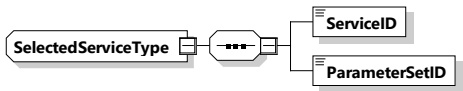
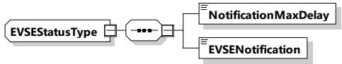

<table border=1 style='margin: auto; word-wrap: break-word;'><tr><td style='text-align: center; word-wrap: break-word;'>Element Name</td><td style='text-align: center; word-wrap: break-word;'>Type</td><td style='text-align: center; word-wrap: break-word;'>Semantics</td></tr><tr><td rowspan="2">SelectedService</td><td style='text-align: center; word-wrap: break-word;'>complexType:</td><td rowspan="2">This element is used to indicate the selected ServiceID and the associated parameterSet.</td></tr><tr><td style='text-align: center; word-wrap: break-word;'>SelectedServiceType refer to 8.3.5.3.25</td></tr></table>

8.3.5.3.25 SelectedServiceType

[V2G20-1335] The EVCC and the SECC shall implement this type as defined in Table 119 and Figure 122.

Figure 122 — Schema diagram - SelectedServiceType

The elements of this message are used according to Table 119.

Table 119 — Semantics and type definition for SelectedServiceType

<table border=1 style='margin: auto; word-wrap: break-word;'><tr><td style='text-align: center; word-wrap: break-word;'>Element Name</td><td style='text-align: center; word-wrap: break-word;'>Type</td><td style='text-align: center; word-wrap: break-word;'>Semantics</td></tr><tr><td style='text-align: center; word-wrap: break-word;'>ServiceID</td><td style='text-align: center; word-wrap: break-word;'>simpleType: serviceIDType refer to Annex A for the type definition</td><td style='text-align: center; word-wrap: break-word;'>Unique identifier of the service</td></tr><tr><td style='text-align: center; word-wrap: break-word;'>ParameterSetID</td><td style='text-align: center; word-wrap: break-word;'>simpleType: serviceIDType refer to Annex A for the type definition</td><td style='text-align: center; word-wrap: break-word;'>This element is used to select a specific parameter set for a specific ServiceID when selecting a service using the ServiceSelectionReq message.</td></tr></table>

###### 8.3.5.3.26 EVSEStatusType

[V2G20-1338]

The EVCC and the SECC shall implement this type as defined in Table 120 and Figure 123.

Figure 123 — Schema diagram - EVSEStatusType

The elements of this message are used according to Table 120.

Table 120 — Semantics and type definition for EVSEStatusType

