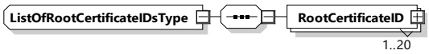

<table border=1 style='margin: auto; word-wrap: break-word;'><tr><td style='text-align: center; word-wrap: break-word;'>Element Name</td><td style='text-align: center; word-wrap: break-word;'>Type</td><td style='text-align: center; word-wrap: break-word;'>Semantics</td></tr><tr><td style='text-align: center; word-wrap: break-word;'>NotificationMaxDelay</td><td style='text-align: center; word-wrap: break-word;'>simpleType: xs:unsignedShort</td><td style='text-align: center; word-wrap: break-word;'>This value is the time in seconds from the point in time this message is sent (relative time) and expected to perform the action immediately. The SECC uses the NotificationMaxDelay element in the EVSEStatus to indicate the time until it expects the EVCC to react on the action request indicated in EVSENotification.</td></tr><tr><td style='text-align: center; word-wrap: break-word;'>EVSENotification</td><td style='text-align: center; word-wrap: break-word;'>simpleType: EVSENotificationType Enumeration refer to Annex A for the type definition</td><td style='text-align: center; word-wrap: break-word;'>This value is used by the SECC to influence the behavior of the EVCC. The EVSENotification contains an action that the SECC wants the EVCC to perform. The requested action is expected by the EVCC until the time provided in NotificationMaxDelay. If the target time is not in the future, the EVCC is expected to perform the action immediately. Requestable actions are: - ScheduleRenegotiation, - ServiceRenegotiation, - MeteringConfirmation, - Pause, - ExitStandby, - Terminate.</td></tr></table>

###### 8.3.5.3.27 ListOfRootCertificateIDsType

[V2G20-1339] The SECC and the EVCC shall implement this type as defined in Table 121 and Figure 124.

Figure 124 — Schema diagram - ListOfRootCertificateIDsType

The elements of this message are used according to Table 121.

Table 121 — Semantics and type definition for ListOfRootCertificateIDsType

<table border=1 style='margin: auto; word-wrap: break-word;'><tr><td style='text-align: center; word-wrap: break-word;'>Element Name</td><td style='text-align: center; word-wrap: break-word;'>Type</td><td style='text-align: center; word-wrap: break-word;'>Semantics</td></tr><tr><td style='text-align: center; word-wrap: break-word;'>RootCertificateID</td><td style='text-align: center; word-wrap: break-word;'>complexType: xmslg:X509IssuerSerialType</td><td style='text-align: center; word-wrap: break-word;'>This message element uniquely identifies a V2G root certificate installed in the EVCC.</td></tr></table>

###### 8.3.5.3.28 DisplayParametersType

## [V2G20-1343]

The SECC and the EVCC shall implement this type as defined in Table 122 and Figure 125.

NOTE 1 The DisplayParameters have no influence on the energy transfer and are optional for both sides.