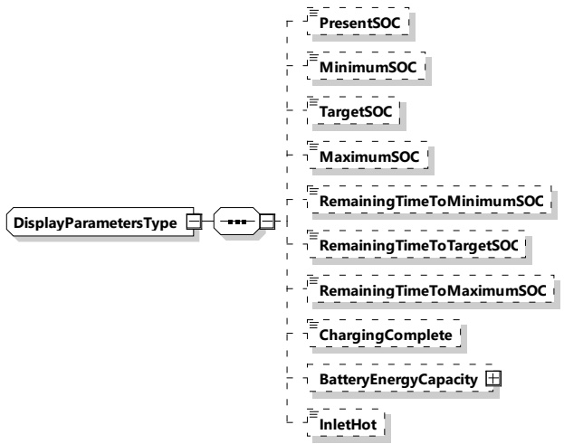

Figure 125 — Schema diagram - DisplayParametersType

The elements of this message are used according to Table 122.

Table 122 — Semantics and type definition for - DisplayParametersType

<table border=1 style='margin: auto; word-wrap: break-word;'><tr><td style='text-align: center; word-wrap: break-word;'>Element Name</td><td style='text-align: center; word-wrap: break-word;'>Type</td><td style='text-align: center; word-wrap: break-word;'>Semantics</td></tr><tr><td rowspan="3">PresentSOC</td><td style='text-align: center; word-wrap: break-word;'>simpleType:</td><td style='text-align: center; word-wrap: break-word;'>Optional:</td></tr><tr><td style='text-align: center; word-wrap: break-word;'>percentValueType</td><td style='text-align: center; word-wrap: break-word;'>Current State of Charge of the EV battery</td></tr><tr><td style='text-align: center; word-wrap: break-word;'>refer to Annex A for the type definition</td><td style='text-align: center; word-wrap: break-word;'>Mandatory when service parameter MobilityNeedsMode was set to 2</td></tr><tr><td rowspan="3">MinimumSOC</td><td style='text-align: center; word-wrap: break-word;'>simpleType:</td><td style='text-align: center; word-wrap: break-word;'>Optional:</td></tr><tr><td style='text-align: center; word-wrap: break-word;'>percentValueType</td><td style='text-align: center; word-wrap: break-word;'>Minimum State of Charge EV needs after charging of the EV battery the EV to keep throughout the charging session.</td></tr><tr><td style='text-align: center; word-wrap: break-word;'>refer to Annex A for the type definition</td><td style='text-align: center; word-wrap: break-word;'>Mandatory when service parameter MobilityNeedsMode was set to 2</td></tr><tr><td rowspan="3">TargetSOC</td><td style='text-align: center; word-wrap: break-word;'>simpleType:</td><td style='text-align: center; word-wrap: break-word;'>Optional:</td></tr><tr><td style='text-align: center; word-wrap: break-word;'>percentValueType</td><td style='text-align: center; word-wrap: break-word;'>Target State of Charge of the EV battery EV needs after charging</td></tr><tr><td style='text-align: center; word-wrap: break-word;'>refer to Annex A for the type definition</td><td style='text-align: center; word-wrap: break-word;'>Mandatory when service parameter MobilityNeedsMode was set to 2</td></tr><tr><td rowspan="3">MaximumSOC</td><td style='text-align: center; word-wrap: break-word;'>simpleType:</td><td style='text-align: center; word-wrap: break-word;'>Optional:</td></tr><tr><td style='text-align: center; word-wrap: break-word;'>percentValueType</td><td rowspan="2">The SOC at which the EV will prohibit any further charging.</td></tr><tr><td style='text-align: center; word-wrap: break-word;'>refer to Annex A for the type definition</td></tr></table>