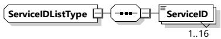
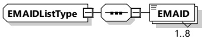

Figure 126 — Schema diagram - ServiceIDListType

The elements of this message are used according to Table 123.

Table 123 — Semantics and type definition for ServiceIDListType

<table border=1 style='margin: auto; word-wrap: break-word;'><tr><td style='text-align: center; word-wrap: break-word;'>Element Name</td><td style='text-align: center; word-wrap: break-word;'>Type</td><td style='text-align: center; word-wrap: break-word;'>Semantics</td></tr><tr><td style='text-align: center; word-wrap: break-word;'>ServiceID</td><td style='text-align: center; word-wrap: break-word;'>simpleType:serviceIDTyperefer to Annex A for the type definition</td><td style='text-align: center; word-wrap: break-word;'>This element identifies a service which has been offered by the SECC in the ServiceDiscoveryRes message.</td></tr></table>

###### 8.3.5.3.30 EMAIDListType

[V2G20-1588] The SECC and the EVCC shall implement this type as defined in Figure 127 and Table 124.

Figure 127 — Schema diagram - EMAIDListType

The elements of this message are used according to Table 124.

Table 124 — Semantics and type definition for EMAIDListType

<table border=1 style='margin: auto; word-wrap: break-word;'><tr><td style='text-align: center; word-wrap: break-word;'>Element Name</td><td style='text-align: center; word-wrap: break-word;'>Type</td><td style='text-align: center; word-wrap: break-word;'>Semantics</td></tr><tr><td style='text-align: center; word-wrap: break-word;'>EMAID</td><td style='text-align: center; word-wrap: break-word;'>simpleType identifierType refer to Annex A for the type definition</td><td style='text-align: center; word-wrap: break-word;'>Contains the EMAID as defined in C.1.</td></tr></table>

###### 8.3.5.3.31 EIM_AReqAuthorizationModeType

This type contains all elements of the AuthorizationReq message that are only required in case the authorization mode EIM is chosen.

[V2G20-1875]

The SECC and the EVCC shall implement this type as defined in Table 125 and Figure 128.

EIM\_AReqAuthorizationModeType

Figure 128 — Schema diagram - EIM_AReqAuthorizationModeType

Table 125 — Semantics and type definition for EIM_AReqAuthorizationModeType

