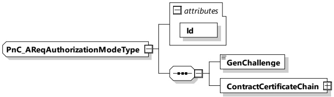

<table border=1 style='margin: auto; word-wrap: break-word;'><tr><td style='text-align: center; word-wrap: break-word;'>Element name</td><td style='text-align: center; word-wrap: break-word;'>Type</td><td style='text-align: center; word-wrap: break-word;'>Semantics</td></tr><tr><td style='text-align: center; word-wrap: break-word;'>n/a</td><td style='text-align: center; word-wrap: break-word;'>n/a</td><td style='text-align: center; word-wrap: break-word;'>n/a</td></tr></table>

NOTE This parameter does not contain any elements.

###### 8.3.5.3.32 PnC_AReqAuthorizationModeType

This type contains all elements of the AuthorizationReq message that are only required in case the authorization mode PnC is chosen.

G20-1782] The SECC and the EVCC shall implement this type as defined in Table 126 and Figure 129.

Figure 129 — Schema diagram - PnC_AReqAuthorizationModeType

The elements of this message are used according to Table 126.

Table 126 — Semantics and type definition for PnC_AReqAuthorizationModeType

<table border=1 style='margin: auto; word-wrap: break-word;'><tr><td style='text-align: center; word-wrap: break-word;'>Element name</td><td style='text-align: center; word-wrap: break-word;'>Type</td><td style='text-align: center; word-wrap: break-word;'>Semantics</td></tr><tr><td style='text-align: center; word-wrap: break-word;'>Id</td><td style='text-align: center; word-wrap: break-word;'>simpleType:xs:ID</td><td style='text-align: center; word-wrap: break-word;'>This attribute is used for referencing the GenChallenge element in the signature header.</td></tr><tr><td style='text-align: center; word-wrap: break-word;'>GenChallenge</td><td style='text-align: center; word-wrap: break-word;'>simpleType:genChallengeType</td><td style='text-align: center; word-wrap: break-word;'>The challenge sent by the SECC in AuthorizationSetupRes message. This element contains the generated random number.</td></tr><tr><td style='text-align: center; word-wrap: break-word;'>ContractCertificateChain</td><td style='text-align: center; word-wrap: break-word;'>complexType:ContractCertificateChainType refer 8.3.5.3.5</td><td style='text-align: center; word-wrap: break-word;'>The certificate chain to be used for authorization of the service(s) being utilized at the EVSE.</td></tr></table>

[V2G20-2110] The GenChallenge field shall be exactly 128 bits long, as stated in [V2G20-697].

[V2G20-2107] The EVCC shall send one (1) contract certificate chain in the element ContractCertificateChain.

NOTE 1 In case EVCC contains more than one (1) contract certificate chains, it is up to the EVCC how to determine the contract certificate chain to be provided.

NOTE 2 One methodology to determine the ontract certificate chain to be provided is the use of the SupportedProviders list. Refer to 8.3.5.3.35 for more details.

###### 8.3.5.3.33 EIM_ASResAuthorizationModeType

[V2G20-1876] The SECC and the EVCC shall implement this type as defined in Figure 130 and Table 127.