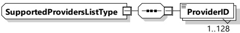

Figure 130 — Schema diagram - EIM_ASResAuthorizationModeType

Table 127 — Semantics and type definition for EIM_ASResAuthorizationModeType

<table border=1 style='margin: auto; word-wrap: break-word;'><tr><td style='text-align: center; word-wrap: break-word;'>Element name</td><td style='text-align: center; word-wrap: break-word;'>Type</td><td style='text-align: center; word-wrap: break-word;'>Semantics</td></tr><tr><td style='text-align: center; word-wrap: break-word;'>n/a</td><td style='text-align: center; word-wrap: break-word;'>n/a</td><td style='text-align: center; word-wrap: break-word;'>n/a</td></tr></table>

NOTE This parameter does not contain any elements.

###### 8.3.5.3.34 PnC_ASResAuthorizationModeType

[V2G20-1877] The SECC and the EVCC shall implement this type as defined in Table 128 and Figure 131.

Figure 131 — Schema diagram - PnC_ASResAuthorizationModeType

The elements of this message are used according to Table 128.

Table 128 — Semantics and type definition for PnC_ASResAuthorizationModeType

<table border=1 style='margin: auto; word-wrap: break-word;'><tr><td style='text-align: center; word-wrap: break-word;'>Element name</td><td style='text-align: center; word-wrap: break-word;'>Type</td><td style='text-align: center; word-wrap: break-word;'>Semantics</td></tr><tr><td style='text-align: center; word-wrap: break-word;'>GenChallenge</td><td style='text-align: center; word-wrap: break-word;'>simpleType: genChallengeType refer to Annex A for the type definition</td><td style='text-align: center; word-wrap: break-word;'>The challenge sent by the SECC in AuthorizationSetupRes message. This element contains the generated random number.</td></tr><tr><td style='text-align: center; word-wrap: break-word;'>SupportedProviders</td><td style='text-align: center; word-wrap: break-word;'>complexType: SupportedProvidersListType refer to 8.3.5.3.35 for the type definition</td><td style='text-align: center; word-wrap: break-word;'>Optional: Provides a list of eMSPs supported by the SECC. This parameter allows EVCC to filter the list of contract certificates to be utilized during the payment authorization. Refer to 8.3.4.3.3.1 for further details.</td></tr></table>

[V2G20-697] The GenChallenge field shall be exactly 128 bits long.

[V2G20-2108] GenChallenge shall be generated per random number generation requirements as defined by 7.3.7.

[V2G20-698] The entropy of the GenChallenge field shall be at least 120 bits.

8.3.5.3.35 SupportedProvidersListType

[V2G20-2703] The SECC and the EVCC shall implement this type as defined in Figure 132 and Table 129.

Copied with the permission of ANSI on behalf of ISO in connection with USDOT National Electric Vehicle Infrastructure (NEVI) Formula Program. Copying not permitted. ©ISO. All rights reserved.