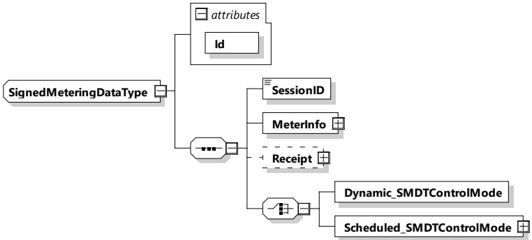

Figure 132 — Schema diagram - SupportedProvidersListType

The elements of this message are used according to Table 129.

Table 129 — Semantics and type definition for SupportedProvidersListType

<table border=1 style='margin: auto; word-wrap: break-word;'><tr><td style='text-align: center; word-wrap: break-word;'>Element name</td><td style='text-align: center; word-wrap: break-word;'>Type</td><td style='text-align: center; word-wrap: break-word;'>Semantics</td></tr><tr><td style='text-align: center; word-wrap: break-word;'>ProviderID</td><td style='text-align: center; word-wrap: break-word;'>simpleType:nameTyperefer to Annex A for the type definition</td><td style='text-align: center; word-wrap: break-word;'>Alphanumeric characters referring to the eMSP. These are nominally the country code and the provider ID similar to those included in the EMAID. Refer to C.1 for more details of EMAID. The list shall be in ascending order with 0-9 followed by A-Z. All characters shall be in uppercase only.The SupportedProviders includes at least 1 Provider and may include up to 128 providers.</td></tr></table>

###### 8.3.5.3.36 SignedMeteringDataType

[V2G20-2647]

The SECC and the EVCC shall implement this type as defined in Figure 133 and Table 130.

Figure 133 — Schema diagram - SignedMeteringDataType

The elements of this message are used according to Table 130.

Table 130 — Semantics and type definition for SignedMeteringDataType

<table border=1 style='margin: auto; word-wrap: break-word;'><tr><td style='text-align: center; word-wrap: break-word;'>Element name</td><td style='text-align: center; word-wrap: break-word;'>Type</td><td style='text-align: center; word-wrap: break-word;'>Semantics</td></tr><tr><td style='text-align: center; word-wrap: break-word;'>SessionID</td><td style='text-align: center; word-wrap: break-word;'>simpleType: sessionIDType refer to Annex A for the type definition</td><td style='text-align: center; word-wrap: break-word;'>This message element is used by EVCC and SECC for uniquely identifying a V2G communication session. This element is identical with the one included in the message header. It is placed in the body in addition to be able to apply a signature to it (complete body is signed).</td></tr></table>