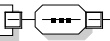

<table border=1 style='margin: auto; word-wrap: break-word;'><tr><td style='text-align: center; word-wrap: break-word;'>Element name</td><td style='text-align: center; word-wrap: break-word;'>Type</td><td style='text-align: center; word-wrap: break-word;'>Semantics</td></tr><tr><td style='text-align: center; word-wrap: break-word;'>MeterInfo</td><td style='text-align: center; word-wrap: break-word;'>complexType:MeterInfoTyperefer to 8.3.5.3.6 for the type definition</td><td style='text-align: center; word-wrap: break-word;'>Includes the energy charged during this service session and other meter relevant data.</td></tr><tr><td style='text-align: center; word-wrap: break-word;'>Receipt</td><td style='text-align: center; word-wrap: break-word;'>complexType:ReceiptTyperefer to 8.3.5.3.59 for the type definition</td><td style='text-align: center; word-wrap: break-word;'>Optional:Includes the receipt as provided by the SECC.</td></tr><tr><td style='text-align: center; word-wrap: break-word;'>Dynamic_SMDTControlMode</td><td style='text-align: center; word-wrap: break-word;'>complexType:Dynamic_SMDTControlModeTyperefer to 8.3.5.3.37 for the type definition</td><td style='text-align: center; word-wrap: break-word;'>Contains all elements that are only required in case the dynamic control mode was chosen.</td></tr><tr><td style='text-align: center; word-wrap: break-word;'>Scheduled_SMDTControlMode</td><td style='text-align: center; word-wrap: break-word;'>complexType:Scheduled_SMDTControlModeTyperefer to 8.3.5.3.38 for the type definition</td><td style='text-align: center; word-wrap: break-word;'>Contains all elements that are only required in case the scheduled control mode was chosen.</td></tr></table>

###### 8.3.5.3.37 Dynamic_SMDTControlMode

This type contains all elements of the SignedMeteringDataType that are only required in case the dynamic control mode is chosen.

[V2G20-1875] The SECC and the EVCC shall implement this type as defined in Figure 134 and Table 131.

Dynamic_SMDTControlModeType

Figure 134 — Schema diagram - Dynamic_SMDTControlMode

Table 131 — Semantics and type definition for Dynamic_SMDTControlMode

<table border=1 style='margin: auto; word-wrap: break-word;'><tr><td style='text-align: center; word-wrap: break-word;'>Element name</td><td style='text-align: center; word-wrap: break-word;'>Type</td><td style='text-align: center; word-wrap: break-word;'>Semantics</td></tr><tr><td style='text-align: center; word-wrap: break-word;'>n/a</td><td style='text-align: center; word-wrap: break-word;'>n/a</td><td style='text-align: center; word-wrap: break-word;'>n/a</td></tr></table>

NOTE This parameter does not contain any elements.

###### 8.3.5.3.38 Scheduled_SMDTControlMode

This type contains all elements of the SignedMeteringDataType that are only required in case the scheduled control mode is chosen.

[V2G20-1875]

The SECC and the EVCC shall implement this type as defined in Figure 135 and Table 132.

Scheduled_SMDTControlModeType

SelectedScheduleTupleID

## Figure 135 — Schema diagram - Scheduled_SMDTControlMode

The elements of this message are used according to Table 132.

## Table 132 — Semantics and type definition for Scheduled_SMDTControlMode

© ISO 2022 – All rights reserved

Copied with the permission of ANSI on behalf of ISO in connection with USDOT National Electric Vehicle Infrastructure (NEVI) Formula Program. Copying not permitted. ©ISO. All rights reserved.