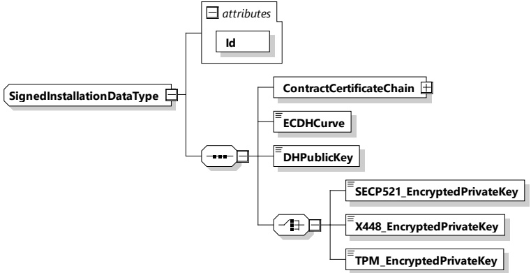

<table border=1 style='margin: auto; word-wrap: break-word;'><tr><td style='text-align: center; word-wrap: break-word;'>Element name</td><td style='text-align: center; word-wrap: break-word;'>Type</td><td style='text-align: center; word-wrap: break-word;'>Semantics</td></tr><tr><td style='text-align: center; word-wrap: break-word;'>SelectedScheduleTupleID</td><td style='text-align: center; word-wrap: break-word;'>simpleType:numericIDTyperefer to Annex A for the type definition</td><td style='text-align: center; word-wrap: break-word;'>This element includes the ScheduleTupleID the EV chose for this session.</td></tr></table>

8.3.5.3.39 SignedInstallationDataType

[V2G20-1878]

The SECC and the EVCC shall implement this type as defined in Figure 136 and Table 133.

Figure 136 — Schema diagram - SignedInstallationDataType

The elements of this message are used according to Table 133.

Table 133 — Semantics and type definition for SignedInstallationDataType

<table border=1 style='margin: auto; word-wrap: break-word;'><tr><td style='text-align: center; word-wrap: break-word;'>Element name</td><td style='text-align: center; word-wrap: break-word;'>Type</td><td style='text-align: center; word-wrap: break-word;'>Semantics</td></tr><tr><td style='text-align: center; word-wrap: break-word;'>ContractCertificateChain</td><td style='text-align: center; word-wrap: break-word;'>complexType:ContractCertificateChainTyperefer 8.3.5.3.5</td><td style='text-align: center; word-wrap: break-word;'>The certificate chain to be used for authorization of the service(s) being utilized at the EVSE.</td></tr><tr><td style='text-align: center; word-wrap: break-word;'>ECDHCurve</td><td style='text-align: center; word-wrap: break-word;'>simpleType:ECDHCurveTyperefer to Annex A for the type definition</td><td style='text-align: center; word-wrap: break-word;'>Parameter indicating which (elliptic curve) EC the eMSP wants to use for generating the session key (seed) used to encrypt the contract certificate private key.</td></tr><tr><td style='text-align: center; word-wrap: break-word;'>DHPublicKey</td><td style='text-align: center; word-wrap: break-word;'>simpleType:dhKeyTyperefer to Annex A for the type definition</td><td style='text-align: center; word-wrap: break-word;'>Diffie Hellman public key from the SA for generating the session key at the EVCC in order to encrypt the contract signature private key at the SA and decrypt it a the EVCC. Refer to 7.9.2.5.4 for details.</td></tr></table>