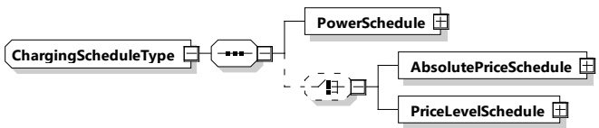

<table border=1 style='margin: auto; word-wrap: break-word;'><tr><td style='text-align: center; word-wrap: break-word;'>Element name</td><td style='text-align: center; word-wrap: break-word;'>Type</td><td style='text-align: center; word-wrap: break-word;'>Semantics</td></tr><tr><td style='text-align: center; word-wrap: break-word;'>SECP521_EncryptedPrivate Key</td><td style='text-align: center; word-wrap: break-word;'>simpleType: secp521_EncryptedPrivateKeyType refer to Annex A for the type definition</td><td style='text-align: center; word-wrap: break-word;'>The 521-bit private key that belongs to the new contract certificate encrypted for EVCCs without the TPM. This is secret data and therefore shall be encrypted. Refer to 7.9.2.5.2 and its subclauses for details.</td></tr><tr><td style='text-align: center; word-wrap: break-word;'>X448_EncryptedPrivateKey</td><td style='text-align: center; word-wrap: break-word;'>simpleType: x448_EncryptedPrivateKeyType refer to Annex A for the type definition</td><td style='text-align: center; word-wrap: break-word;'>The 448-bit private key that belongs to the new contract certificate encrypted for EVCCs without the TPM. This is secret data and therefore shall be encrypted. Refer to 7.9.2.5 and its subclauses for details.</td></tr><tr><td style='text-align: center; word-wrap: break-word;'>TPM_EncryptedPrivateKey</td><td style='text-align: center; word-wrap: break-word;'>simpleType: tpm_EncryptedPrivateKeyType refer to Annex A for the type definition</td><td style='text-align: center; word-wrap: break-word;'>The private key that belongs to the new contract certificate encrypted for EVCCs with the TPM. This is secret data and therefore shall be encrypted. Refer to 7.9.2.5.3 and its subclauses for details.</td></tr></table>

NOTE Details of various elements in SignedInstallationDataType can be found in 7.9.2.5 and 8.3.4.3.9 and their subclauses.

###### 8.3.5.3.40 Charging Schedule Type

[V2G20-1879]

The SECC and the EVCC shall implement this type as defined in Figure 137 and Table 134.

Figure 137 — Schema diagram - ChargingScheduleType

The elements of this message are used according to Table 134.

Table 134 — Semantics and type definition for ChargingScheduleType

<table border=1 style='margin: auto; word-wrap: break-word;'><tr><td style='text-align: center; word-wrap: break-word;'>Element name</td><td style='text-align: center; word-wrap: break-word;'>Type</td><td style='text-align: center; word-wrap: break-word;'>Semantics</td></tr><tr><td style='text-align: center; word-wrap: break-word;'>PowerSchedule</td><td style='text-align: center; word-wrap: break-word;'>complexType:PowerScheduleTyperefer to 8.3.5.3.18</td><td style='text-align: center; word-wrap: break-word;'>Encapsulating element describing all relevant details for one PowerSchedule as defined by the secondary actor or the SECC. It is used to communicate the hard limit of charging power</td></tr><tr><td style='text-align: center; word-wrap: break-word;'>AbsolutePriceSchedule</td><td style='text-align: center; word-wrap: break-word;'>complexType:AbsolutePriceScheduleTypePriceScheduleTyperefer to 8.3.5.3.49</td><td style='text-align: center; word-wrap: break-word;'>Optional:Absolute Price schedule for this session</td></tr></table>